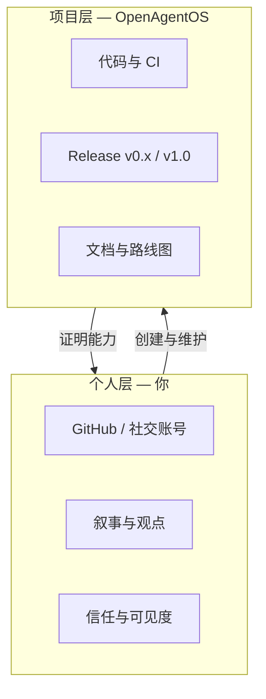

# OpenAgentOS 个人品牌与项目运营指南

本文档说明：作为 **个人创作者** 如何与 **OpenAgentOS 开源项目** 协同，建立长期技术品牌。

---

## 1. 品牌分层



| 名称 | 用途 | 示例 |
|------|------|------|
| **OpenAgentOS** | 产品 / 仓库 / 对外协议名 | `github.com/William2333ZZ/OpenAgentOS` |
| **个人 GitHub** | 人格、Contributions、Star 关系 | Profile README 指向 OpenAgentOS |
| **工程版本 v7.x** | 技术讨论、Issue、PR | 「v7.2 policy load 已合并」 |
| **产品版本 v0.x** | Release、媒体、客户 POC | 「v0.2-rc 双平台 v7」 |

避免混用：对外 Press 用 **OpenAgentOS v0.2-rc**；内核 commit 可写 `v7.2: policy load from ramfs`。

---

## 2. 定位一句话

**中文**：OpenAgentOS 是 Agent 原生操作系统——Agent 是一等公民，Capability + Tool 网关 + 可审计 IPC，可在 QEMU 与边缘设备上运行。

**English**：OpenAgentOS is an agent-native operating system where agents are first-class citizens, with capability isolation, a unified tool gateway, and reproducible QEMU demos.

---

## 3. 内容支柱（Content Pillars）

每月至少覆盖 **1 个支柱**，与 [PRODUCT_ROADMAP.md](./PRODUCT_ROADMAP.md) Release 对齐：

| 支柱 | 内容形式 | 示例选题 |
|------|----------|----------|
| **Build in public** | GitHub Release + 短帖 | v0.2-rc 双平台 v7 验收录屏 |
| **Deep dive** | 长文 / 文档 | 为什么 Tool 网关而不是直接 syscall |
| **Demo 60s** | 屏录 GIF / 视频 | `make run-x86-v01-beta` + `/fleet push` |
| **对比** | 表格 / 图 | OpenAgentOS vs LangChain vs Linux 容器 |
| **Roadmap** | 季度更新 | v0.x → v1.0 时间线 |

推荐渠道（按优先级）：

1. **GitHub** — Release、Discussions、Profile README  
2. **中文社区** — 知乎 / 掘金 / 飞书文档镜像（链回 GitHub）  
3. **英文** — Dev.to / Hacker News Show（v1.0 前可选）  
4. **视频** — B 站 / YouTube 60s QEMU 演示  

---

## 4. GitHub Profile 模板

在 Profile README（`William2333ZZ/William2333ZZ`）中：

```markdown
### Hi, I'm building OpenAgentOS

Agent-native OS — agents, capabilities, and tools at the kernel level.

- 🔧 [OpenAgentOS](https://github.com/William2333ZZ/OpenAgentOS) — v0.1-beta on QEMU x86
- 📖 [Product roadmap](https://github.com/William2333ZZ/OpenAgentOS/blob/main/docs/PRODUCT_ROADMAP.md)
- ⚡ Quick: `make check-v0.1-beta`
```

---

## 5. Release 节奏（建议）

| 类型 | 频率 | 内容 |
|------|------|------|
| **patch** | 按需 | CI 修复、文档 |
| **minor (v0.x-rc)** | 6–8 周 | 新能力 + `check-*` + Release Note |
| **major (v1.0)** | 里程碑 | ABI 冻结、LTS 承诺 |

每次 Release  checklist：

- [ ] `make check-v0.x-*` 绿  
- [ ] [PRODUCT_ROADMAP.md](./PRODUCT_ROADMAP.md) 与 [RELEASE_ITERATIONS.md](./RELEASE_ITERATIONS.md) 更新  
- [ ] 对应 `V0.x.0_PLAN.md` → 交付后写 `V0.x.0.md`  
- [ ] GitHub Release Note（中英文各一段）  
- [ ] 60s 演示录屏或 GIF  
- [ ] 社交帖 1 条（链到 Release）  

---

## 6. 商标与命名

- 代码：**Apache-2.0**（见 [LICENSE](../LICENSE)）  
- 名称 **OpenAgentOS**：他人可 fork 修改，但不宜自称「官方 OpenAgentOS」发行版 unless 授权  
- 个人品牌可写：「OpenAgentOS 作者 / 维护者」  

---

## 7. POC / 商业路径（可选）

| 阶段 | 对象 | 交付 |
|------|------|------|
| 爱好者 | 开发者 | 开源 repo + 文档 |
| POC | 集成商 | v0.x-rc 镜像 + 定制 `/policy` + 支持邮箱 |
| 商业 | 企业 | v1.0 LTS 订阅、BSP 定制（v8+） |

个人品牌在此的角色：**技术可信度**；合同与 SLA 用 **项目/公司主体**（可后期注册）。

---

## 8. 下一步行动（立即可做）

1. 完善 GitHub Repo About：Topics `agent`, `operating-system`, `riscv`, `qemu`, `embedded`  
2. 开启 **Discussions**  
3. 为 **v0.2-rc** 写 Release Note 草稿（随代码合并）  
4. Profile README 指向 OpenAgentOS  
5. 每完成一个 `make check-*`，截图进 `docs/assets/`（可选）

---

## 9. 叙事时间线（示例）

| 日期 | 里程碑 | 对外话术 |
|------|--------|----------|
| 2026-06 | v0.1-beta 开源 | 「PC 上可跑的 Agent 子 OS」 |
| 2026-07 | v0.2-rc | 「双平台 v7 + 策略文件」 |
| 2026 Q4 | v0.3-rc | 「Fleet 真正上网」 |
| 2027 Q3 | v1.0 GA | 「可生产的 Agent 边缘 OS」 |

保持 **同一仓库、同一品牌、递增版本** —— 个人品牌随项目里程碑自然积累，无需两套代码。
