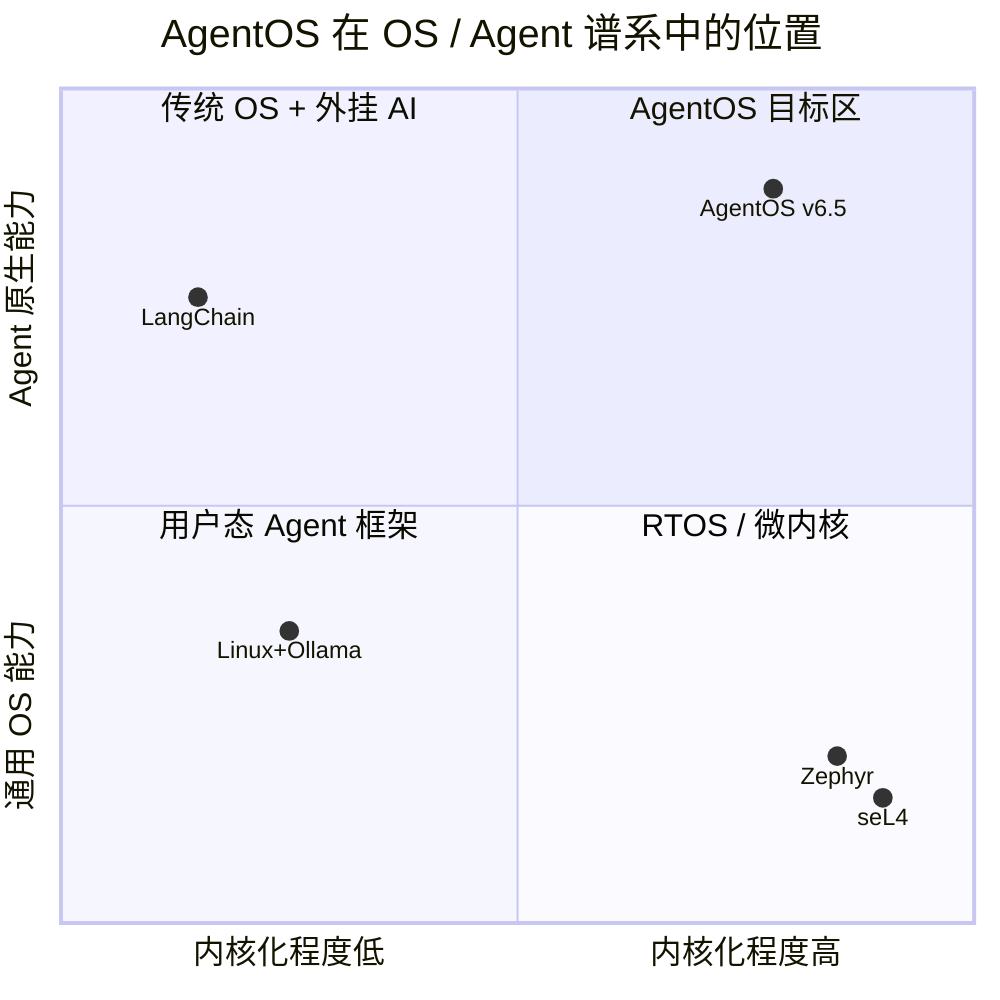
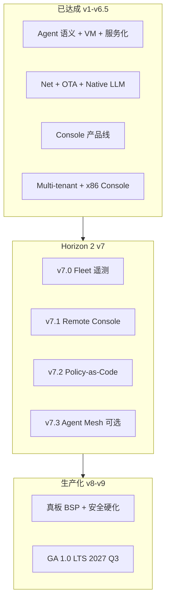

# AgentOS 操作系统对标与度量计划

日期：2026-06-08  
基线：**v6.5**（Multi-tenant + x86 Console 全矩阵 ✅）

相关：[ROADMAP.md](./ROADMAP.md) · [V6_IMPLEMENTATION.md](./V6_IMPLEMENTATION.md) · [V7_IMPLEMENTATION.md](./V7_IMPLEMENTATION.md) · [ARCHITECTURE.md](./ARCHITECTURE.md)

---

## 1. 定位：对标什么、不对标什么

AgentOS **不是**要在通用吞吐上击败 Linux，而是证明 **Agent 原生 OS** 在以下维度可度量、可验收：

| 维度 | 我们要证明的 | 刻意不对标 |
|------|--------------|------------|
| 信任边界 | Capability + Tool audit + 服务 Agent 隔离 | Linux 全功能 POSIX、systemd 生态 |
| 持久 Agent 状态 | session / ramfs / AOS2 / OTA 跨重启 | 数据库、K8s 编排 |
| 多 Agent 协作 | IPC + orchestrator + steer/compact | LangChain 插件数量 |
| 边缘可部署 | 小内核、无 GPU 可运行、`-nographic` CI | 桌面应用兼容性 |
| 交付形态 | `.agent` ELF + OTA 包 | deb/rpm/Docker 镜像 |

**一句话**：对标 **「微内核 + Agent 运行时 + 可审计 Tool 网关」** 的组合体，而不是对标 Ubuntu。

---

## 2. 参照系分层



### 2.1 与通用 OS 的概念映射

| 通用 OS（Linux） | AgentOS | 验收 / 代码锚点 |
|------------------|---------|-----------------|
| `fork` / `exec` | `agent_spawn` / `agent_load` | `check-load`, `check-console-pack` |
| `pipe` / socket | `agent_send` / `msgbox` | `check-orchestrator`, `check-console-orch` |
| `open/read/write` | `TOOL_READ/WRITE` + storage 服务 | `check-v1`, `check-storage2` |
| `capabilities(7)` / SELinux | `CAP_*` + `tool.c` policy | `check-tools2` |
| `systemd` unit | 服务 Agent（router/net/display/console） | `check-router`, `check-console` |
| journald | UART + ramfs tool audit | `check-tools2`, `check-wrap` |
| `apt upgrade` | OTA verify/apply | `check-ota`, `/ota` in pack demo |
| terminal / fbcon | Console REPL + display 服务 | `check-console*`, `check-ui` |
| 多用户 / 多租户 | （规划 v6）多租户 session 分区 | v6.0 ✅ `check-console-tenant` |
| 资源配额 | cgroup | v6.3 ✅ ipc/tool/fs quota |
| x86 双平台 | — | v6.5 ✅ `check-console-x86-all` |
| 完整 TCP/IP | netstack + network 服务 | `check-net-prod`, `check-llm-net` |

### 2.2 与 Agent 框架的差异

| 能力 | LangChain / CrewAI | AgentOS v6.5 |
|------|-------------------|--------------|
| 运行环境 | 宿主 Python 进程 | 独立内核 + U-mode Agent |
| 权限模型 | OS 用户权限 | per-Agent CAP + Tool 网关 |
| 跨重启记忆 | 需外接 DB | session + AOS2 + `/compact` |
| 动态加载 Agent | 动态 import | `agent_load(.agent ELF)` |
| 自动化回归 | 单元测试为主 | **`make check-*` 端到端** |
| 人机界面 | Web / IDE 插件 | UART REPL（默认）+ GPU 可选 |

### 2.3 与 RTOS / 微内核

| 项 | Zephyr / FreeRTOS | seL4 系 | AgentOS |
|----|-------------------|---------|---------|
| 调度单元 | 线程 | 线程 + capability | **Agent**（phase + 邮箱） |
| IPC | 队列 / mailbox | sync IPC | 消息 + steer/follow-up/summary |
| 应用模型 | C 回调 | CAmkES 组件 | **Agent ELF + libagent** |
| LLM / session | 无 | 无 | **内核级 Tool + session** |
| 典型部署 | MCU | 高 assurance | 边缘盒 + 无 GPU PC |

---

## 3. 度量维度（Benchmark 指标）

### 3.1 一级指标（产品叙事）

| ID | 指标 | 定义 | 当前基线（2026-06） | 目标（v7） |
|----|------|------|---------------------|------------|
| **B1** | 冷启动到可交互 | 启动 → 首条 `agentos>` prompt | ~1.5s（QEMU RV）；x86 ~2s | ≤2s 双平台 |
| **B2** | 无 GPU 全功能路径 | 不挂 GPU 完成 LLM+session+load+tenant | `check-console*` + x86-all 全绿 | 保持 |
| **B3** | E2E 验收耗时 | 单条 `make check-console` | **~5s** | ≤8s |
| **B4** | 失败快速退出 | 验收失败时脚本上限 | **~30s**（fail-fast） | ≤45s（x86 长测） |
| **B5** | 跨重启状态 | 第二次 boot 恢复 session/OTA | `check-load` boot2 | + pack persist |
| **B6** | 动态 Agent | load worker → sum=42 | `check-console-pack` ~4s | 保持 |
| **B7** | 原生联网 LLM | Guest 内 HTTPS DeepSeek | `check-llm-net` | + 超时预算文档化 |
| **B8** | 内核体积 | `kernel-console-pack.elf` | 待脚本化 | 报告 trend |
| **B9** | Fleet 遥测 | 指标上报 + 心跳 | v7.0 规划 | `check-console-fleet` |

### 3.2 二级指标（工程对标，分阶段落地）

| ID | 指标 | 方法 | 计划版本 |
|----|------|------|----------|
| **M1** | IPC 往返延迟 | 两 Agent ping-pong N 次，tick 差 | v5.5 `bench-ipc.sh` |
| **M2** | Tool 分发开销 | ADD vs CONSOLE READ_CHAR 空转 | v5.5（优化 audit 热路径） |
| **M3** | 调度公平性 | console 空转 + loaded worker 饿死回归 | v5.3 ✅ `sched_notify` on load |
| **M4** | session compact 正确性 | keep=N 后首行 summary | v5.1 ✅ |
| **M5** | OTA 包 verify/apply | 签名 + 回滚 | v4.2 ✅ / v5.6 ✅ `check-catalog` |
| **M6** | 页故障隔离 | 恶意 Agent EFAULT 不拖垮内核 | v3.0 ✅ `check-vm3` |
| **M7** | SMP 扩展 | 双 hart 并发 Agent | v4.1 ✅ `check-smp` |
| **M8** | 多架构 ABI 一致 | 同 libagent 源码 RV/x86 | v6.5 ✅ `check-console-x86-all` |

### 3.3 三级指标（对外 Demo / 论文级，可选）

| 场景 | 对比对象 | 展示方式 |
|------|----------|----------|
| 边缘告警 | Linux + shell + curl LLM | 同硬件 UART 日志 side-by-side |
| 多 Agent 编排 | Python asyncio | `check-console-orch` 日志 |
| 包交付 | Docker pull | `/load worker.agent` + OTA |
| 审计 | 无 audit 的脚本 | `check-tools2` EPERM + audit 行 |

---

## 4. 自动化验收矩阵（= 当前 Benchmark 实现）

**原则**：每个维度至少一条 `make check-*`；Console 线为无 GPU 默认回归。

| 对标能力 | 命令 | 典型耗时 | GPU |
|----------|------|----------|-----|
| REPL + LLM | `check-console` | ~5s | 否 |
| session + compact | `check-console-session` | ~5s | 否 |
| 多 Agent 编排 | `check-console-orch` | ~5s | 否 |
| 动态包加载 | `check-console-pack` | ~4s | 否 |
| GPU 人机界面 | `check-ui` | ~10s | 是 |
| UART 人机回退 | `check-ui-console` | ~5s | 否 |
| 块设备 persist | `check-v1` / `check-load` | ~10–20s | 否 |
| 原生 HTTPS LLM | `check-llm-net` | 网络依赖 | 否 |
| OTA | `check-ota` | ~15s | 否 |
| Package catalog | `check-catalog` | ~15s | 否 |
| Multi-tenant | `check-console-tenant` | ~15s | 否 |
| Audit 分区 | `check-console-audit` | ~4s | 否 |
| Namespace | `check-console-namespace` | ~3s | 否 |
| Resource quota | `check-console-quota` | ~3s | 否 |
| x86 Console 全矩阵 | `check-console-x86-all` | ~17s | 否 |
| 生产 TCP/HTTP | `check-net-prod` | ~10s | 否 |
| Platform 双架构 | `check-platform` | ~30s | 否 |

**CI 推荐分组**：

```bash
# 快速层（~30s）：每次 PR
make check-console check-console-session check-console-orch check-console-pack

# 标准层（~5min）： nightly
make check-console-tenant check-console-audit check-console-namespace check-console-quota
make check-ui-console check-load check-router check-ota check-vm3 check-platform

# x86 层（~20s）
make check-console-x86-all check-wrap-x86

# 扩展层：需网络 / GPU runner
make check-ui check-llm-net
```

**Fail-fast**（v5.3 后）：`scripts/check-console-common.sh` — 检测 console page fault / 异常 exit，**~30s 超时**，不再空等 200s。

---

## 5. 版本演进与对标里程碑



| 版本 | 对标里程碑 | 新增度量 |
|------|------------|----------|
| **v5.0–v5.6** ✅ | 「无 GPU 也是完整 OS」+ 包目录 | B2–B6 + check-console* |
| **v6.0–v6.5** ✅ | 「多租户 + 双平台 Console」 | tenant/audit/quota + x86-all |
| **v7.0** | 「设备可被 Fleet 看见」 | B9 心跳 + 指标 |
| **v7.1** | 「Headless 可远程管」 | Remote REPL 延迟 |
| **v7.2** | 「策略可配置可审计」 | policy load + deny 验收 |
| **v8.0** | 「生产候选 RC」 | 真板 smoke + 安全 |
| **GA 1.0** | 「可签 SLA 的 LTS」 | 回滚演练 + 12mo 补丁 |

---

## 6. 已知差距与改进项（影响 Benchmark 可信度）

| 差距 | 影响 | 计划 |
|------|------|------|
| CONSOLE `READ_CHAR` 每次 tool audit | 日志膨胀、空转 CPU 高 | v5.5 热路径跳过 audit 或合并 |
| 无统一 `make bench` | 指标分散在 check 脚本 | v5.5 `scripts/bench-*.sh` ✅ |
| x86 全量内核未移植 | 仅 Console 子集在 x86 | v6.5 ✅ Console 矩阵；wrap ✅ |
| 无真实硬件 CI | QEMU 与板卡偏差 | v8 真板 smoke |
| 无 Fleet / 远程管 | 无法字段运维 | **v7.0–v7.1** |
| session compact 走文件读而非 MSG recv | 与 pi 语义略异 | 文档化 |

---

## 7. 如何使用本文档

1. **写产品材料**：用 §2 映射表 + §3.1 一级指标  
2. **排版本**：用 §5 里程碑对齐 ROADMAP  
3. **加测试**：新能力必须增加 §4 矩阵中的一行  
4. **做性能优化**：以 §3.2 M* 编号开 issue，落地 `bench-*` 脚本  

维护规则：每完成一个 v6.x / v7.x 子版本，更新 §3.1 基线列与 §4 矩阵。
