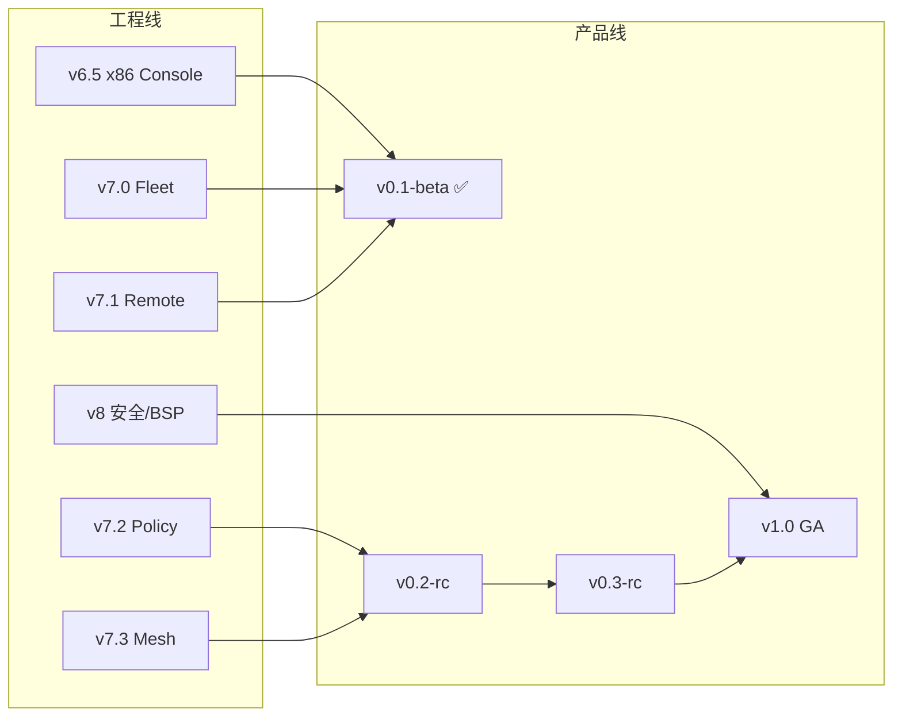

# OpenAgentOS 产品路线图（统一版）

日期：2026-06-08  
维护者：OpenAgentOS 项目  
相关：[ROADMAP.md](./ROADMAP.md) · [V7_IMPLEMENTATION.md](./V7_IMPLEMENTATION.md) · [V0.1_BETA.md](./V0.1_BETA.md) · [BRAND.md](./BRAND.md)

---

## 1. 两套版本号：工程 vs 产品

| 维度 | 命名 | 示例 | 用途 |
|------|------|------|------|
| **工程迭代** | v6.x / v7.x / v8.x | v7.0 Fleet | 内核模块、Tool ID、设计文档 |
| **产品发布** | v0.x-beta / v0.x-rc / **v1.0** | v0.1-beta → v0.2-rc → v1.0 | GitHub Release、对外宣传、ABI 冻结 |



**原则**：工程可以并行；产品 Release 只打包「可验收、可演示、可写文档」的组合。

---

## 2. 已交付：v0.1-beta（2026-06）

| 项 | 状态 |
|----|------|
| 平台 | x86_64-pc QEMU 子 OS |
| 能力 | v6 全家桶 + v7 Fleet/Policy/Remote/Mesh |
| 验收 | `make check-v0.1-beta` |
| 许可 | Apache-2.0 · [GitHub](https://github.com/William2333ZZ/OpenAgentOS) |

---

## 3. 当前迭代：v0.2-rc（目标 2026-07）

**主题**：双平台 v7 + 策略可加载 + 分项验收

| 子项 | 交付 | 验收 |
|------|------|------|
| v7 RISC-V | `kernel-console-v7.elf` | `make check-console-v7` |
| x86 Fleet 子集 | 独立脚本 | `make check-fleet-x86` |
| Policy 文件加载 | 种子 `/sys/policy/active` + `/policy load` | `make check-v0.2-rc` |
| Fleet Collector | `tools/fleet-collector.py` | 文档 + 手动 POST |
| 产品内核 | `kernel-x86-v02-rc.elf` | `make check-v0.2-rc` |

**非目标（v0.2 不做）**：真板 BSP、VirtIO-net 生产栈、Mesh 跨 QEMU。

---

## 4. v0.3-rc → v1.0 GA 路径

| 版本 | 时间（基准） | 主题 | 退出标准 |
|------|-------------|------|----------|
| **v0.3-rc** | 2026 Q4 | VirtIO-net Fleet push + Remote TCP 真链路 | `check-remote-console` 绿 |
| **v0.9-rc** | 2027 Q2 | OTA 签名强制 + 渗透测试修复 | 安全审计清单 |
| **v1.0 GA** | 2027 Q3 | stable/LTS 渠道、集成商文档、≥1 真板 smoke | 见 [V7_IMPLEMENTATION.md](./V7_IMPLEMENTATION.md) §6.2 |

### v8 工程线（支撑 v1.0）

- 启动链签名、看门狗、audit 防篡改
- ≥2 BSP（RISC-V SBC + x86 工控）
- CI 三层：fast (~2min) / standard (~10min) / nightly

---

## 5. 能力矩阵（规划）

| 能力 | v0.1-beta | v0.2-rc | v0.3-rc | v1.0 |
|------|-----------|---------|---------|------|
| x86 Console 子 OS | ✅ | ✅ | ✅ | ✅ |
| RISC-V v7 栈 | stub | ✅ | ✅ | ✅ |
| Policy 文件 load | 内存 deny | ✅ ramfs | ✅ GitOps 文档 | ✅ |
| Fleet HTTP push | stub | collector | net 栈 | 生产 TLS |
| Remote Console | host stub | stub | TCP 真链路 | token+审计 |
| Mesh 跨设备 | beacon | beacon | host relay | 可选 |
| 真板 | — | — | smoke | 必选 |

---

## 6. 验收命令速查

```bash
# 产品 Release _gate
make check-v0.1-beta      # x86 全栈 GA
make check-v0.2-rc        # v0.2 产品候选

# v7 分项
make check-console-v7     # RISC-V v7
make check-fleet-x86      # x86 Fleet 子集

# 回归
make check-console-x86-all check-platform
```

---

## 7. ABI 与破坏性变更

- **v0.x**：Tool 22–25 已分配，仅追加不修改语义
- **v1.0**：syscall + Tool 表冻结声明；breaking 仅 major
- 每个产品 Release 更新 [SYSCALL.md](./SYSCALL.md) 与 Release Notes

---

## 8. 与个人品牌的关系

产品路线图由 **OpenAgentOS** 项目承载；个人品牌负责叙事、信任与社区。详见 **[BRAND.md](./BRAND.md)**。

| 层 | 载体 |
|----|------|
| 项目 | `William2333ZZ/OpenAgentOS`、Releases、CI 绿 |
| 个人 | GitHub Profile、技术文章、演示视频、会议分享 |
| 叙事 | 「Agent 原生 OS 从 0 到可运行子系统」 |

建议每个 **产品 minor**（v0.2、v0.3）配一篇 **Story 文章 + 60s 录屏 + Release Note**，形成可检索的时间线。
