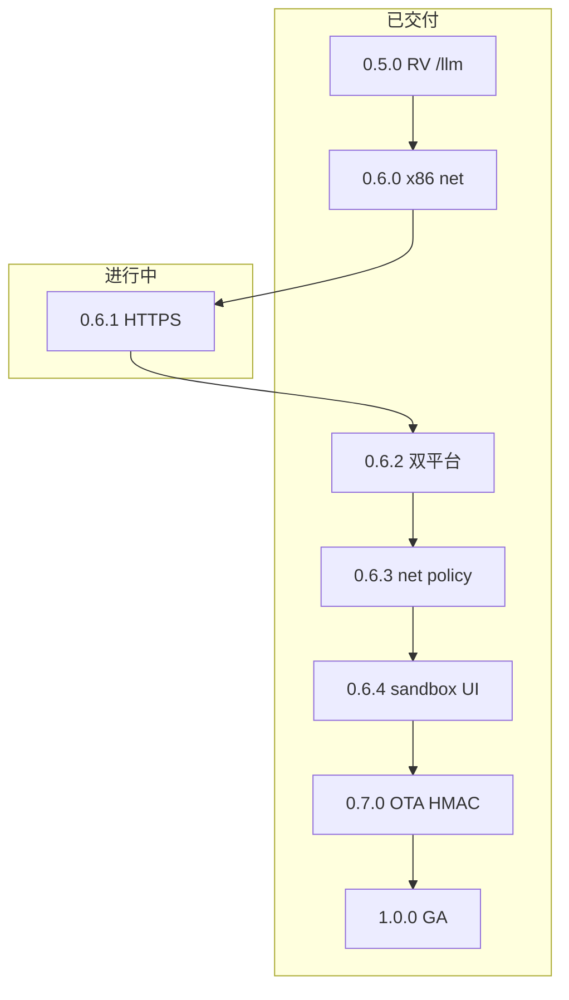

# OpenAgentOS 产品版本迭代总览

日期：2026-06  
维护者：OpenAgentOS 项目  
相关：[VERSIONING.md](./VERSIONING.md) · [V0.6.x.md](./V0.6.x.md) · [V1.0.0.md](./V1.0.0.md) · [SANDBOX.md](./SANDBOX.md)

---

## 1. SemVer 策略（0.x 阶段）

| 段 | 含义 | 示例 |
|----|------|------|
| **MINOR** | 产品主题线 | `0.6` = Agent Sandbox + Network |
| **PATCH** | 可交付增量 | `0.6.0` → `0.6.1` → … → `0.6.4` |
| **MAJOR** | 产品 GA | **`1.0.0`** |
| **Security minor** | 正交能力线 | `0.7` = OTA HMAC |

**用户期望**：0.6 线走 patch 迭代；**1.0.0** 为 QEMU 可验收 GA。

---

## 2. 迭代链

---

## 3. 版本表

### 已交付

| 版本 | 主题 | 文档 | check |
|------|------|------|-------|
| 0.1.0 – 0.5.0 | 见 [VERSIONING.md](./VERSIONING.md) | V0.4/V0.5 等 | `check-0.1.0` … `check-0.5.0` |
| **0.6.0** | x86 sandbox-net | [V0.6.0.md](./V0.6.0.md) | `check-0.6.0` ✅ |
| **0.6.2** | 双平台 + router | [V0.6.2_PLAN.md](./V0.6.2_PLAN.md) | `check-0.6.2` ✅ |
| **0.6.3** | Network egress | [V0.6.3_PLAN.md](./V0.6.3_PLAN.md) | `check-0.6.3` ✅ |
| **0.6.4** | `/sandbox status` | [V0.6.4_PLAN.md](./V0.6.4_PLAN.md) | `check-0.6.4` ✅ |
| **0.7.0** | OTA format-2 HMAC | [V0.7.0.md](./V0.7.0.md) | `check-0.7.0` ✅ |
| **1.0.0** | QEMU GA | [V1.0.0.md](./V1.0.0.md) | **`check-ga-1.0`** ✅ |

### 进行中

| Patch | 状态 | 主题 | 设计 |
|-------|------|------|------|
| **0.6.1** | ⚠️ | HTTPS fleet + router faux | [V0.6.1_PLAN.md](./V0.6.1_PLAN.md) |

总览：[V0.6.x.md](./V0.6.x.md) · Sandbox 模型：[SANDBOX.md](./SANDBOX.md)

---

## 4. 能力矩阵（0.5 → 1.0）

| 能力 | 0.5.0 | 0.6.0 | 0.6.1 | 0.6.2 | 0.6.3 | 0.6.4 | 0.7.0 | 1.0.0 |
|------|-------|-------|-------|-------|-------|-------|-------|-------|
| RV /llm HTTPS | ✅ | ✅ | ✅ | ✅ | ✅ | ✅ | ✅ | ✅ |
| x86 net CI | — | ✅ | ✅ | ✅ | ✅ | ✅ | ✅ | ✅ |
| x86 router faux | — | — | ⚠️ | ✅ | ✅ | ✅ | ✅ | ✅ |
| Fleet HTTPS | — | — | ⚠️ | ✅ | ✅ | ✅ | ✅ | ✅ |
| Net policy | — | — | — | — | ✅ | ✅ | ✅ | ✅ |
| /sandbox | — | — | — | — | — | ✅ | ✅ | ✅ |
| OTA HMAC | — | — | — | — | — | — | ✅ | ✅ |
| GA gate | — | — | — | — | — | — | — | ✅ |

---

## 5. 每个 PATCH 交付流程

1. 更新对应 `V0.6.N_PLAN.md` 或发布 `V0.6.N.md`  
2. 实现 + `make check-0.6.N`  
3. bump `include/version.h`（GA 时 → 1.0.0）  
4. GitHub Release tag  
5. **1.0.0**：额外跑 `make check-ga-1.0`

---

## 6. 当前行动

- [x] 0.6.0 – 0.6.4 patch 栈（除 0.6.1 TLS）  
- [x] 0.7.0 OTA format-2 HMAC  
- [x] 1.0.0 `check-ga-1.0`  
- [ ] 修 `check-0.6.1` HTTPS ingest  
- [ ] GitHub Release tag `1.0.0`  
- [ ] 真板 LTS（[V1.0.0_PLAN.md](./V1.0.0_PLAN.md)）
