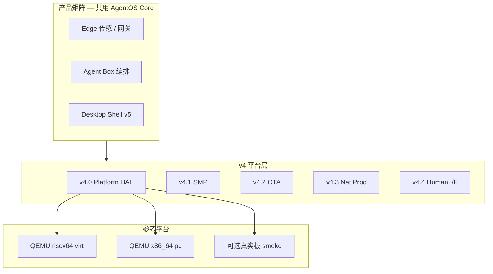
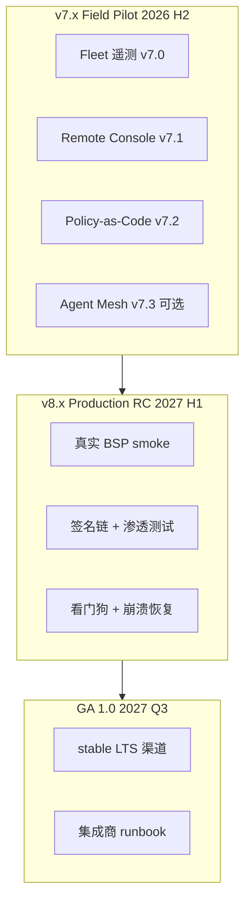

# AgentOS 路线图

日期：2026-06-08（**v0.1-beta** x86 GA ✅；见 [V0.1_BETA.md](./V0.1_BETA.md)）

本文档描述 AgentOS **未来应用方向**与**分阶段实现计划**。当前基线：**v0.1-beta**（v6.5 + v7 Fleet/Remote/Policy/Mesh，x86 子 OS 可运行）。

相关文档：[DESIGN.md](./DESIGN.md) · [ARCHITECTURE.md](./ARCHITECTURE.md) · [AGENT_MODEL.md](./AGENT_MODEL.md) · [V5_IMPLEMENTATION.md](./V5_IMPLEMENTATION.md) · [V6_IMPLEMENTATION.md](./V6_IMPLEMENTATION.md) · [V7_IMPLEMENTATION.md](./V7_IMPLEMENTATION.md) · [OS_BENCHMARK.md](./OS_BENCHMARK.md)

---

## 1. 愿景与定位

AgentOS 不是「小型 Linux」，也不是「Linux 上跑的 LangChain」，而是 **Agent 原生操作系统**：

| 传统 OS / 框架 | AgentOS |
|----------------|---------|
| 进程 | Agent（带 phase、caps、邮箱） |
| 文件权限 | Capability + Tool policy + audit |
| 管道 / socket | 消息 IPC（steer / follow-up / compact） |
| 系统调用 | Tool 网关 + 少量 syscall |
| 应用层 LLM 框架 | **内核级** session / router / persist |
| 磁盘 | ramfs + AOS2 块设备持久化 + OTA |

**产品定位（一句话）**：以 Agent 为一等公民的轻量 OS——从边缘板卡到 x86 PC，同一套 Agent ABI、能力模型与 OTA 包格式。

**适用场景**：

| 产品线 | 用户 | 卖点 | 典型硬件 |
|--------|------|------|----------|
| **AgentOS Edge** | 集成商 / 开发者 | 极小 TCB、可审计、cap 隔离、离线 persist | RISC-V SBC / MCU 类板 |
| **AgentOS Box** | 企业边缘 | 多 Agent pipeline + OTA + audit | 多核 + eMMC |
| **AgentOS Desktop** | 极客 / 研究（v5） | Agent 原生 Shell、本地 router、隐私 | **x86 PC** / 未来 RISC-V 工作站 |

**架构策略（多平台，不绑厂商）**：

- **主线**：继续以 **QEMU 参考机** 做 CI（RISC-V `virt` 为当前默认；v4.0 起并列 **x86 PC** 参考机）
- **交付**：HAL + 平台描述（DTB / 固定 platform table），换平台不换 Agent 语义
- **不追求**：v4 内移植「所有板卡」；追求 **同一内核 + 同一 OTA 包** 在 N 个参考平台上可验收

### 1.1 对标

| 类型 | 代表 | AgentOS 差异 |
|------|------|--------------|
| 通用 OS | Linux / Windows | Agent 是一等公民；LLM/session/persist 是 syscall 级能力，非用户态补丁 |
| RTOS | Zephyr / FreeRTOS | 保留消息与实时性，增加多 Agent 编排、Tool 网关、块设备记忆 |
| Agent 框架 | LangChain / CrewAI / AutoGen | 无内核边界、无跨重启 persist、无 cap 审计；AgentOS 是全栈运行时 |
| IDE Agent | Cursor / Copilot | 依附宿主 OS；AgentOS 可独立运行在设备或 PC 上 |
| 「Agent OS」概念 | 各类套壳 demo | 本项目具备真实微内核路径、服务 Agent、`check-*` 自动化验收 |

**度量与验收**：一级指标（启动时间、无 GPU 全路径、E2E ~5s）、完整对标矩阵与 CI 分组见 **[OS_BENCHMARK.md](./OS_BENCHMARK.md)**。

---

## 2. 未来应用方向

### 2.1 有记忆的 LLM 终端（Memory Agent）

**故事**：设备重启后，Agent 从块设备恢复 session/note，继续与 DeepSeek 对话。

```
[init] → [memory-worker]
            ├─ storage IPC 读 /sys/version
            ├─ session_append / session_tail
            ├─ agent_llm（VirtIO → DeepSeek）
            └─ agent_sync → AOS1 落盘
```

**价值**：验证「Agent 原生持久化」相对「Linux + SQLite」的差异。

### 2.2 多 Agent 编排（Orchestration）

**故事**：Planner 拆任务 → Worker 调 Tool → LLM Worker 总结；Storage 统一 FS。

```
[planner] ──MSG_TASK──► [worker] ──MSG_RESULT──► [planner]
                              │
                              └── MSG_FS_* ──► [storage]
[planner] ──MSG_TASK──► [llm-worker] ──agent_llm──► host
```

**价值**：对标 pi Agent Harness，但在真实 U-mode + CAP 隔离下运行。

### 2.3 边缘传感 + 异常解释（Edge Insight）

**故事**：采集 Agent 写 `/agent/<id>/samples`；规则 Agent 检测阈值；LLM Agent 生成自然语言告警；全部 persist。

**价值**：UART 日志 + 小块持久化 + 云端推理，无需完整 OS。

### 2.4 可审计 Tool 自动化（Policy Gateway）

**故事**：所有 IO（FS、LLM、未来 GPIO/HTTP）经 Tool 网关；策略按 path/cap 校验；session 记录每次 Tool 调用。

**价值**：比 shell 脚本更安全、比 microservice 更轻。

### 2.5 服务化 Agent OS（Service Agents）

**故事**：storage(id=2) 模式扩展到 network、crypto、model-router；普通 Agent 仅 IPC，无直接 CAP。

**价值**：微内核式信任边界，适合多租户或安全敏感场景。

---

## 3. 分阶段实现

每个阶段包含：**目标 · 内核/用户改动 · Demo · 验收 · 依赖**。


### v3.1 → v4.0：为何不能直接跳？

v3.1 证明的是 **垂直场景故事**（传感 → 规则 → LLM → 落盘），v4 要交付的是 **可部署产品**（多平台、多核、OTA、长期演进）。v3.2–v3.5 已补齐平台能力层；v4 起 **不再新增大 Agent 语义**，主要是 **集成、规模与多架构**。

| 维度 | v3.5 现状 | v4 目标 | v4 要补什么 |
|------|-----------|---------|-------------|
| **应用形态** | 动态 ELF + 静态 demo 并存 | Agent 包独立 OTA | v4.2 签名包 + manifest |
| **外部 IO** | HTTP/LLM 经 bridge stub | 生产网络 + 离线策略 | v4.3 TCP/TLS + router 配额 |
| **状态演进** | AOS2 + migrate ✅ | 字段/桌面跨版本升级 | v4.2 系统包 + A/B |
| **平台** | QEMU RISC-V virt 单参考机 | **RISC-V + x86 PC** 双参考机 | v4.0 HAL + `PLATFORM=` |
| **规模** | 单 hart | 多核 + 更多并发 Agent | v4.1 SMP |
| **人机界面** | UART 日志 | 桌面预埋 | v4.4 GPU/输入；v5 Shell |

**路径原则**：

1. **v1–v3.5**：Agent OS 语义 + `check-*` 验收 ✅
2. **v4.0–v4.4**：平台化、产品化（每子版本独立验收）✅
3. **v5.0–v5.6**：Console 产品线（无 GPU 默认路径）✅
4. **v6.0–v6.5**：多租户 + 资源隔离 + x86 Console 矩阵 ✅
5. **v7.x**：Fleet 遥测、Remote Console、Policy-as-Code（Field Pilot）
6. **v8–v9**：生产硬化 → **GA 1.0**（目标 2027-Q3，见 [V7_IMPLEMENTATION.md](./V7_IMPLEMENTATION.md) §6）

**推荐下一迭代**：**v7.0 Fleet 遥测**。

### Phase v1.2 — Memory + LLM 联合 Demo

| 项 | 内容 |
|----|------|
| **目标** | 一条链路打通 persist + session + storage IPC + DeepSeek |
| **内核** | 无必须改动；复用 v1 + llm 构建 |
| **用户** | 新增 `user/demo_memory.c`：worker 读版本 → append session → `agent_llm` → sync → readback |
| **构建** | `kernel-memory.elf`，`scripts/run-memory.sh`（blk + virtio-console + bridge） |
| **验收** | 首次 `[memory] llm answer: ...` + sync；二次启动 `[persist] loading` 且 session tail 含历史 |
| **依赖** | v1.1、`.env` DeepSeek key |
| **工作量** | ~1–2 天 |

### Phase v1.3 — 统一编排 Demo（Orchestrator）

| 项 | 内容 |
|----|------|
| **目标** | init + storage + planner + worker + llm-worker 五 Agent 稳定协作 |
| **内核** | `agent_send` 后可选 `need_resched`；storage 请求序号/简单队列（避免乱序响应） |
| **用户** | `user/demo_orchestrator.c`：planner 发 TASK → worker ADD + svc_read → llm 总结 |
| **libagent** | `agent_svc_*` 带 req id 或同步 RPC 封装 |
| **验收** | `make check-orchestrator` 30s 内通过；无 inbox 死锁 |
| **依赖** | v1.2 |
| **工作量** | ~3–5 天 |

### Phase v2.0 — Session 增强 + LLM 流式 + Compaction 集成

| 项 | 内容 |
|----|------|
| **目标** | 长对话可 compact；LLM delta 写入 session；跨 boot 恢复 LLM 上下文摘要 |
| **内核** | `session_compact(keep)`；`TOOL_SESSION_READ`（读全文或最近 N 行）；LLM phase 与 session 联动 |
| **用户** | 扩展 `demo_memory.c`：steer 打断 + compact + 二次 boot 续聊 |
| **Tool** | `TOOL_SESSION_READ`、`TOOL_SESSION_COMPACT` |
| **验收** | compact 后 inbox/session 含 `MSG_SUMMARY`；DeepSeek 流式 delta 可见 |
| **依赖** | v1.3 |
| **工作量** | ~1 周 |

### Phase v2.1 — Storage 服务 v2

| 项 | 内容 |
|----|------|
| **目标** | storage 支持并发多客户端、请求队列、错误码规范 |
| **内核** | storage 内核线程化或单 Agent 内 FIFO；`MSG_FS_RSP` 带 req_id |
| **协议** | `MSG_FS_*` payload：`req_id\|path` / `req_id\|path\|data` |
| **用户** | worker + worker2 并发读写；`agent_svc_read` 匹配 req_id |
| **验收** | 两 worker 交错 FS 请求，readback 不错乱 |
| **依赖** | v1.3 |
| **工作量** | ~1 周 |

### Phase v2.2 — Tool 扩展与策略

| 项 | 内容 |
|----|------|
| **目标** | 可插拔 Tool；审计日志；新能力类型 |
| **内核** | `tool_table` 注册表；`/audit/agent/<id>/tool.log`；`TOOL_GPIO` / `TOOL_HTTP` stub |
| **CAP** | `CAP_NET`、`CAP_GPIO`（占位） |
| **Demo** | `demo_tools` 扩展：policy 拒绝 + audit 记录 |
| **验收** | 无 CAP 调用返回 EPERM 且 audit 有记录 |
| **依赖** | v2.0 |
| **工作量** | ~1 周 |

### Phase v2.3 — v2.x 收尾 ✅

| 项 | 内容 |
|----|------|
| **目标** | 2.x 技术债收束，为 v3.0 内存子系统铺路 |
| **内核** | `RAMFS_MAX_FILES` 16→64；`agent_write`/`agent_create` 经 `copy_from_user`；`trap_handler` 原地 trapframe（去除 local 返回） |
| **持久化** | `/audit/agent/<id>/tool.log` 随 AOS1 落盘恢复 |
| **用户** | `demo_wrap.c`：20 文件 stress + gpio EPERM + 双启动 audit 验证 |
| **验收** | `make check-wrap` boot1 stress+sync；boot2 persist load + audit readback |
| **依赖** | v2.2 |
| **工作量** | ~2–3 天 |

### Phase v3.0 — 内存子系统 ✅

| 项 | 内容 |
|----|------|
| **目标** | demand paging、用户指针严格校验、fault 隔离 |
| **内核** | `vm_heap_fault` / `vm_user_check`；`copy_*_user` 返回 `EFAULT`；`SYS_AGENT_HEAP_*`；trap 栈 local 拷贝 |
| **可选** | 栈 guard 页（`USER_STACK_SLOT` 独立 VA 槽 + 物理 guard 页不映射）；用户代码/只读数据 W^X；heap COW alias（`SYS_AGENT_HEAP_COW`） |
| **用户** | `user/agent_svc.c`（非内联 RPC，避免 req_id 寄存器被 yield 覆盖）；`demo_vm3.c` |
| **验收** | `make check-vm3`；全套 `check-*` 回归通过 |
| **依赖** | v2.x 稳定 |
| **状态** | 已完成 |

### Phase v3.1 — 边缘传感 Demo（Edge） ✅

| 项 | 内容 |
|----|------|
| **目标** | 完整「采集 → 规则 → LLM 解释 → persist」故事 |
| **用户** | `demo_edge.c`：sensor 写 `/agent/samples`；rules 阈值检测；llm-worker 解释异常 |
| **验收** | `make check-edge`：boot1 pipeline+sync；boot2 恢复 samples + llm_last |
| **依赖** | v2.0 + v3.0 |
| **状态** | 已完成 |

### Phase v3.2 — Model Router 服务 Agent ✅

| 项 | 内容 |
|----|------|
| **目标** | LLM 调用统一经 router 服务 Agent，支持 faux / DeepSeek / offline 三态 |
| **内核** | router 持有 `CAP_LLM`；`llm_session_finish` 跳过 router（客户端自行 append） |
| **协议** | `MSG_LLM_REQ` / `MSG_LLM_RSP`；payload `L{req_id}\|{backend}\|{prompt}` |
| **用户** | `user/router_svc.c`、`agent_svc_llm()`；`demo_router.c`；`demo_edge` 改走 router |
| **验收** | `make check-router`；`check-edge` / `check-orchestrator` / `check-vm3` 回归 |
| **依赖** | v3.1 |
| **状态** | 已完成 |

### Phase v3.3 — Agent ELF 动态加载

| 项 | 内容 |
|----|------|
| **目标** | 用户 Agent 从 ramfs/persist 加载 `.agent` ELF，不再与内核同镜像链接 |
| **内核** | `SYS_AGENT_LOAD` (17)；解析 ELF64 PT_LOAD；per-agent 页表映射；W^X 沿用 v3.0 |
| **用户** | `worker.agent`（`linker-agent.ld @ 0x80400000`）+ `demo_load.c`：init 写入/恢复 `/agent/1/worker.agent` 后 `agent_load()` |
| **验收** | `make check-load`：boot1 落盘+加载+worker `sum=42`；boot2 persist 恢复后 reload |
| **依赖** | v3.0（VM + uaccess） |
| **状态** | 已完成 |

### Phase v3.4 — Network 服务 + HTTP Tool

| 项 | 内容 |
|----|------|
| **目标** | VirtIO-net 最小驱动 + network 服务 Agent；`TOOL_HTTP` 经 host bridge |
| **内核** | `virtio_net.c` 设备探测；`agent_http_fetch` + VirtIO console `HTTPQ/HTTPR` bridge；`CAP_NET` 仅 network 服务 |
| **Host** | `tools/http-bridge.py`（端口 5556，类比 deepseek-bridge） |
| **用户** | `network_svc.c` + `agent_svc_http()`；`demo_net.c` faux 拉取 stub URL |
| **验收** | `make check-net`（faux 回环 + offline 拒绝 + audit 留痕） |
| **依赖** | v3.2（bridge 模式） |
| **状态** | 已完成 |

### Phase v3.5 — Persist AOS2 + 迁移

| 项 | 内容 |
|----|------|
| **目标** | superblock 版本化；AOS1→AOS2 在线迁移；为 OTA 铺路 |
| **内核** | `persist_migrate()`；可选更大 inode 表 / 校验和 |
| **用户** | `demo_persist2.c` 或扩展 `check-wrap`：旧盘升级 + readback |
| **验收** | `make check-persist2`：v1 镜像启动 → 自动 migrate → 二次 boot 数据完整 |
| **依赖** | v2.3 persist 稳定 |
| **状态** | 已完成 |

**实现摘要**：
- 磁盘 magic 仍为 `0x31495641`；`version=1` 为 AOS1，`version=2` 为 AOS2
- AOS2 每文件 meta 增加 `crc32`；superblock `checksum` 为各文件 `crc32 ^ size` 的 xor
- 启动见 AOS1 时 `persist_load_v1()` → 自动 `persist_migrate()` → `persist_sync()` 写 AOS2
- `persist_sync()` 始终写 AOS2；VirtIO 读写经 512B sector 缓冲（避免 struct 栈溢出）
- `user/demo_persist2.c` + `scripts/seed-aos1-disk.py` + `scripts/check-persist2.sh`

---

## 3A. v4 / v5 产品路线图（规划）

v4 将 AgentOS 从「QEMU 研究型 demo」升级为 **可 OTA、可多核、可换平台的产品底座**。桌面是 v5 的产品形态，v4 只做能力预埋。



### Phase v4.0 — Platform / HAL（「任意板子 + PC」第一版）

| 项 | 内容 |
|----|------|
| **目标** | 内核与 BSP 解耦；**不绑单一厂商**；双参考机验收 |
| **HAL** | 时钟、UART、中断控制器、VirtIO 探测、内存 map 抽象 |
| **平台** | `PLATFORM=riscv64-virt`（默认，现有基线）；`PLATFORM=x86_64-pc`（QEMU `-machine pc`） |
| **构建** | `ARCH=` / `PLATFORM=` Makefile 维度；Agent syscall ABI **跨平台一致** |
| **启动** | RISC-V：OpenSBI + DTB；x86：Multiboot2 / 简易 boot stub + 固定 platform desc |
| **真板** | 可选 1 块社区 RISC-V SBC 作 smoke（**非** v4.0 阻塞项） |
| **验收** | `make check-platform` ✅：RISC-V wrap+persist2 + x86 `check-wrap-x86` |
| **进展** | x86 `kernel-x86-wrap.elf`：i386 分页、TSS、IDT、`int 0x80`、PCI virtio-blk modern；PIC 启动全屏蔽 + 用户态后开 timer |
| **依赖** | v3.5 |
| **状态** | **✅ 完成**（双平台 wrap 验收通过） |
| **不做** | 完整 Linux 驱动、ext4、GUI |

**已实现（2026-06）**：
- `include/platform.h` + `kernel/platform_rv.c` / `platform_riscv_virt.c` / `platform_x86_pc.c`
- UART / VirtIO / VM MMIO / heap 经 platform 描述符，不再硬编码
- `boot_banner()` 启动时打印 `platform: riscv64-virt`
- x86：`kernel-x86-smoke.elf` + **`kernel-x86-wrap.elf`**（`kernel/arch/x86/` trap/vm/timer/switch/virtio-pci）
- 构建：`PLATFORM=` 维度、`make check-wrap-x86`、Agent syscall `int 0x80`（与 RISC-V 同号）
- 工具链：`i686-elf-gcc`（Homebrew `i686-elf-gcc`）用于 x86 构建

**x86 PC 的意义**：覆盖现有开发者桌面与云 VM；便于本地跑 router bridge、OTA 工具链；与「未来 RISC-V 桌面」共用同一 Agent 包格式。

### Phase v4.1 — SMP（规模底座）

| 项 | 内容 |
|----|------|
| **目标** | 多 hart / 多核下 Agent 调度正确 |
| **内核** | per-CPU runqueue；IPI 唤醒；mailbox 跨核锁 |
| **验收** | `make check-smp`：双 hart 并发 Agent + stress；`check-*` 回归 |
| **依赖** | v4.0 |
| **状态** | **已完成**（per-CPU runqueue、SBI IPI 唤醒、跨核调度、check-smp 验收） |

**已实现（2026-06）**：
- `kernel/smp.c`：HSM 唤醒从核；SBI IPI 跨核 kick；`bsp_ready` 启动屏障
- `kernel/sched.c`：per-CPU runqueue + `home_cpu` 亲和；`sched_cpu_run_loop`；IPI/SSI trap 唤醒
- `kernel/entry.S` / `trap.S`：主核 16KiB 栈、从核 secondary 栈、per-hart trap stack
- `kernel/spinlock.c` + `ipc.c` / `sched.c` / `mem.c` / `uart.c` 跨核锁
- `user/demo_smp.c` + `make check-smp`（`-smp 2`，双 worker 并发 + init 收消息）
- **回归修复**：`trap_vector` 4 字节对齐；SSI 返回 trap 栈帧；S-mode 禁止直写 ACLINT
- 全部 RISC-V `kernel_*.c` 统一 `smp_boot` + `boot_riscv.h` 启动

### Phase v4.2 — OTA（产品生命线）

| 项 | 内容 |
|----|------|
| **目标** | 字段设备与 PC 均可 **无感升级** Agent 与系统状态 |
| **Agent 包** | 签名 ELF + manifest（版本、caps、依赖）；复用 v3.3 `agent_load` |
| **System 包** | 内核镜像 + AOS2 增量；复用 v3.5 migrate |
| **Channel** | stable / beta；单分区 migrate 或 A/B 分区（可选） |
| **验收** | `make check-ota`：旧内核启动 → OTA → 新 Agent 运行 + ramfs 数据仍在 |
| **依赖** | v3.3 + v3.5 + v4.0 |
| **状态** | **已完成** |

**已实现（2026-06）**：
- `include/ota.h` + `kernel/ota.c`：AOPK manifest、CRC32 签名校验、channel 过滤、`ota_apply_package`
- `TOOL_OTA`（apply / verify / channel / kernel_gen）经 Tool 网关
- `scripts/mk-agentpkg.py`：主机侧打包 `.agentpkg`
- `kernel-ota-old.elf`（gen=1 stub）→ `kernel-ota.elf`（gen=2 全量 OTA）双内核验收
- `user/demo_ota.c`：boot1 旧内核 seed v1 + stage 包；boot2 新内核 apply v2 + persist 回归
- `make check-ota`：marker + v1 worker + staged pkg → OTA → `ver=2 sum=84`

### Phase v4.3 — Production Network ✅

| 项 | 内容 |
|----|------|
| **目标** | 走出 HTTP stub；生产级 router 策略 |
| **网络** | VirtIO-net + 内核 TCP/IP + HTTP GET（QEMU user-net / 10.0.2.15） |
| **Router** | `prod` backend：quota（4 次/启动）、live→cache fallback、多 backend 路由 |
| **缓存** | network agent 写入 `/agent/7/net-cache/`（ramfs） |
| **验收** | `make check-net-prod`：原生 HTTP（无 http-bridge）+ cache 降级 + quota + audit |
| **依赖** | v3.4 + v4.0 |

**已实现**：
- `kernel/virtio_net.c`：VirtIO-net MMIO 驱动（RX/TX virtqueue）
- `kernel/netstack.c`：ARP + IPv4 + TCP + HTTP GET 客户端
- `user/network_prod_svc.c`：`native`/`prod`/`offline` 多后端 + quota + cache fallback
- `user/demo_net_prod.c` + `kernel/kernel_net_prod.c` → `kernel-net-prod.elf`
- `scripts/check-net-prod.sh`：QEMU `-netdev user` + 主机 `tools/net-test-server.py` 验收

### Phase v4.3.1 — Native LLM Network ✅

| 项 | 内容 |
|----|------|
| **目标** | Guest 内 VirtIO-net + mbedTLS 直连 DeepSeek `deepseek-chat`（无 VirtIO console bridge） |
| **网络** | DHCP/DNS/DoH 回退、TCP、TLS、HTTP POST；DNS 过滤 fake IP（198.18.0.0/15） |
| **LLM** | `kernel/llm_deepseek.c`：原生 HTTPS 优先；CloudFront TLS 受限时回退 `http://10.0.2.2:8443`（`tools/deepseek-net-gw.py`） |
| **构建** | `kernel-llm-net.elf`（2MB 堆 + mbedTLS）；`scripts/mk-deepseek-{key,host}.sh` 生成 API key / 构建时 IP |
| **验收** | `make check-llm-net`：QEMU user-net + gateway + 真实 API 返回 `42` |
| **依赖** | v4.3 + v3.2 LLM router 语义 |

**已实现（2026-06）**：
- `kernel/netstack.c`：UDP/DHCP/DNS/DoH/TCP/HTTP
- `kernel/tls_client.c`：mbedTLS 客户端、`net_https_post`
- `kernel/llm_deepseek.c` + `kernel/kernel_llm_net.c`
- `make run-llm-net`：自动启动 host gateway 并运行 QEMU

**已知限制**：部分 CDN（如 `api.deepseek.com` CloudFront）对 mbedTLS ClientHello 返回 FATAL_ALERT；开发/CI 推荐 host gateway 回退路径。

### Phase v4.4 — Human Interface（桌面预埋） ✅

| 项 | 内容 |
|----|------|
| **目标** | 除 UART 外，具备「屏幕 + 输入」服务 Agent |
| **设备** | VirtIO-GPU + virtio-keyboard（可选）；**无 GPU 时回退 UART 控制台** |
| **服务** | `display-agent`（id=8）/ `input-agent`（id=9）；`TOOL_DISPLAY` / `TOOL_INPUT` |
| **用户** | GPU：framebuffer 文本；Console：`[ui-console]` 经 UART 输出/读键 |
| **验收** | `make check-ui`（GPU 路径）；`make check-ui-console`（无 GPU/无键盘，纯串口） |
| **依赖** | v4.0 |

**已实现（2026-06）**：
- `kernel/virtio_gpu.c`：resource/scanout/flush + 文本绘制
- `kernel/virtio_input.c`：virtio-input 键盘事件
- `user/display_svc.c` / `user/input_svc.c` + `user/demo_ui.c` → `kernel-ui.elf`
- `scripts/check-ui.sh`
- `scripts/check-ui-console.sh`：无 virtio-gpu 时 `TOOL_DISPLAY`/`TOOL_INPUT` 走 UART

### Phase v5.3 — Agent Pack Launcher ✅

| 项 | 内容 |
|----|------|
| **目标** | Console 内 list/load `.agent` 包；init 经 `MSG_CONSOLE_REQ` 执行 `agent_load` |
| **命令** | `/list`、`/load <path> [name]`、`/ota verify|apply <pkg>`、`/quit pack` |
| **验收** | `make check-console-pack` ✅（~4s；fail-fast ~30s） |
| **产物** | `kernel-console-pack.elf`、`demo_console_pack.c`、`worker_elf.inc` |
| **内核修复** | `agent_load` → `sched_notify_runnable`（避免 console 空转饿死 worker） |

### Phase v5.4 — Desktop Shell ✅

| 项 | 内容 |
|----|------|
| **目标** | GPU 全屏文本 launcher；无 GPU 时 init fallback 提示 Console |
| **Agent** | `shell-agent` (id=11) |
| **验收** | `make check-desktop` ✅（~5s）；`make check-desktop-console` ✅ |
| **依赖** | v5.3 + v4.4 display/input |
| **设计** | [V5_IMPLEMENTATION.md](./V5_IMPLEMENTATION.md) §8 |

### Phase v5.5 — Headless Box ✅

| 项 | 内容 |
|----|------|
| **目标** | 无 display/input/GPU；UART Console 远程管 + IPC bench |
| **Agent** | 仅 console (id=10) + init；复用 v5.3 pack load |
| **验收** | `make check-box` ✅（~3s）；`make bench-ipc` ✅ |
| **设计** | [V5_IMPLEMENTATION.md](./V5_IMPLEMENTATION.md) §9 |

### Phase v5.6 — Package Catalog ✅

| 项 | 内容 |
|----|------|
| **目标** | 签名包目录、版本约束、回滚策略 |
| **依赖** | v4.2 OTA + v5.3 `/load` |
| **验收** | `make check-catalog` ✅（~15s） |
| **设计** | [V5_IMPLEMENTATION.md](./V5_IMPLEMENTATION.md) §10 |

### Phase v6.0 — Multi-tenant ✅（MVP）

| 项 | 内容 |
|----|------|
| **目标** | 按 Agent 隔离 session、quota、跨租户 probe |
| **依赖** | v5.6 + v5.1 Session |
| **验收** | `make check-console-tenant` ✅（~15s） |
| **设计** | [V6_IMPLEMENTATION.md](./V6_IMPLEMENTATION.md) |

### Phase v6.1 — Audit 分区 ✅（MVP）

| 项 | 内容 |
|----|------|
| **目标** | `/audit/agent/<id>/tool.log` 配额、compact、跨 Agent 读隔离 |
| **依赖** | v6.0 + v2.2 tool audit |
| **验收** | `make check-console-audit` ✅（~4s） |
| **设计** | [V6_IMPLEMENTATION.md](./V6_IMPLEMENTATION.md) §v6.1 |

### Phase v6.2 — Namespace mount ✅（MVP）

| 项 | 内容 |
|----|------|
| **目标** | `/ns/agent/<id>/home/` mount 视图 + 跨 namespace probe |
| **依赖** | v6.1 |
| **验收** | `make check-console-namespace` ✅（~3s） |
| **设计** | [V6_IMPLEMENTATION.md](./V6_IMPLEMENTATION.md) §v6.2 |

### Phase v6.3 — Resource quota ✅（MVP）

| 项 | 内容 |
|----|------|
| **目标** | IPC / Tool / FS 三维 per-agent 配额 |
| **依赖** | v6.2 |
| **验收** | `make check-console-quota` ✅（~3s） |
| **设计** | [V6_IMPLEMENTATION.md](./V6_IMPLEMENTATION.md) §v6.3 |

### Phase v6.4 — x86 Console quota ✅

| 项 | 内容 |
|----|------|
| **目标** | x86_64-pc 上跑 Console quota 子集 |
| **验收** | `make check-console-x86` ✅（~4s） |
| **设计** | [V6_IMPLEMENTATION.md](./V6_IMPLEMENTATION.md) §v6.4 |

### Phase v6.5 — x86 Console 扩展 ✅

| 项 | 内容 |
|----|------|
| **目标** | tenant / audit / namespace 移植 x86 |
| **验收** | `make check-console-x86-all` ✅（~17s） |
| **设计** | [V6_IMPLEMENTATION.md](./V6_IMPLEMENTATION.md) §v6.5 |

---

## 3B. v7 / v8 产品路线图（Horizon 2 → 生产化）

v7 将 AgentOS 从 **单设备 QEMU demo** 升级为 **可运维的字段试点（Field Pilot）**；GA 生产版在 v8–v9 交付。



### Phase v7.0 — Fleet 遥测（规划）

| 项 | 内容 |
|----|------|
| **目标** | 心跳 + 指标 HTTP 上报；Console `/fleet` 命令 |
| **Tool** | `TOOL_FLEET` (22) |
| **验收** | `make check-console-fleet` + `make check-fleet-x86` |
| **依赖** | v6.5 + v4.3 net prod |
| **设计** | [V7_IMPLEMENTATION.md](./V7_IMPLEMENTATION.md) §v7.0 |

### Phase v7.1 — Remote Console（规划）

| 项 | 内容 |
|----|------|
| **目标** | 经 TCP 远程接入 Console REPL（Headless Box 远程管） |
| **验收** | `make check-remote-console` |
| **依赖** | v7.0（可选）+ v4.3 |
| **设计** | [V7_IMPLEMENTATION.md](./V7_IMPLEMENTATION.md) §v7.1 |

### Phase v7.2 — Policy-as-Code（规划）

| 项 | 内容 |
|----|------|
| **目标** | JSON policy manifest；Tool/CAP 可加载策略 |
| **Tool** | `TOOL_POLICY` (23) |
| **验收** | `make check-console-policy` |
| **依赖** | v6.1 audit + v6.3 quota |
| **设计** | [V7_IMPLEMENTATION.md](./V7_IMPLEMENTATION.md) §v7.2 |

### Phase v7.3 — Agent Mesh（可选）

| 项 | 内容 |
|----|------|
| **目标** | 局域网服务发现 + 跨设备 IPC 桥接（单跳 MVP） |
| **验收** | `make check-mesh` |
| **设计** | [V7_IMPLEMENTATION.md](./V7_IMPLEMENTATION.md) §v7.3 |

### 生产化时间预估

| 里程碑 | 目标日期 | 说明 |
|--------|----------|------|
| **Field Pilot (v7)** | 2026 Q4 | 遥测 + 远程管 + 策略；POC 客户可签 |
| **Production RC (v8)** | 2027 Q2 | 真板 BSP、安全硬化 |
| **GA 1.0** | **2027 Q3** | stable LTS、集成商 SLA、回滚演练 |

详见 [V7_IMPLEMENTATION.md](./V7_IMPLEMENTATION.md) §6（含保守/积极场景）。

### Phase v5.0 — Agent 产品层（Console 主线 ✅）

| 项 | 内容 |
|----|------|
| **目标** | 产品级人机交互 + Agent 生态；**GPU 非必需** |
| **形态 A — Desktop** | `shell-agent`、窗口/通知（需 GPU 或宿主 compositor） |
| **形态 B — Console** | TUI / REPL / pi 语义（UART 或 SSH，**默认兼容无 GPU PC**） |
| **形态 C — Headless Box** | 无本地 UI，Web/远程管；盒内只跑 Agent pipeline |
| **组件** | 全局 session；Agent 包分发（v4.2 OTA 延伸） |
| **平台** | x86 PC（含无独显/服务器）；RISC-V 边缘 |
| **依赖** | v4.4（display/input 服务可降级）+ v4.2 OTA |

> v5 默认路径：**Console 优先**（`agent_svc_display` 在 GPU 不可用时已回退 UART），Desktop 为增强形态。

**分阶段实现设计**见 [V5_IMPLEMENTATION.md](./V5_IMPLEMENTATION.md)（v5.0 REPL → v5.1 session → v5.2 orch → v5.3 pack → v5.4 desktop 可选）。

### Phase v5.2 — Orchestrator CLI ✅

| 项 | 内容 |
|----|------|
| **目标** | Console `/run orch` 触发多 Agent pipeline |
| **命令** | `/run orch`、`/status` |
| **验收** | `make check-console-orch` ✅ |
| **产物** | `kernel-console-orch.elf`、`orch_pipeline.c`、`storage_svc.c` |

### Phase v5.1 — Session + Steer ✅

| 项 | 内容 |
|----|------|
| **目标** | 多轮 session、compact 摘要、MSG_STEER |
| **命令** | `/session tail|append`、`/compact [keep]`、`/steer <id> <msg>` |
| **验收** | `make check-console-session` ✅ |
| **产物** | `kernel-console-session.elf`、`demo_console_session.c` |

### Phase v5.0 — Console REPL ✅

| 项 | 内容 |
|----|------|
| **目标** | 无 GPU 可用的交互式命令行；console-agent + `/llm` `/help` |
| **设备** | 仅 UART（`-nographic`）；不依赖 VirtIO-GPU |
| **验收** | `make check-console` ✅ |
| **产物** | `kernel-console.elf`、`user/console_svc.c`、`scripts/check-console.sh` |
| **依赖** | v4.4 Console 回退 + v3.2 router |


1. **不做 Linux 兼容层**（不跑 glibc/Android app）；兼容 **Agent ELF ABI**。
2. **不做训练框架**；只做推理路由与本地/云端切换。
3. **不在 v4 追求「百板齐发」**；参考平台 + 可选 smoke 即可。
4. **不在 v4 交付完整桌面**；完整 Shell 属 v5。

---

## 4. 优先级建议

| 优先级 | 阶段 | 理由 |
|--------|------|------|
| P0 | **v1.2 Memory+LLM** | 最能展示 AgentOS 独特价值；DeepSeek 已通 |
| P1 | **v1.3 Orchestrator** | 证明多 Agent 生产级协作 |
| P2 | **v2.0 Session+Compact** | 长对话与 pi 语义对齐 |
| P3 | **v2.1 Storage v2** | 并发 FS 是服务化基础 |
| P4 | v2.2 Tool 扩展 | 边缘/自动化场景 |
| P4b | **v2.3 v2.x 收尾** | ramfs/uaccess/trap/audit persist |
| P5 | **v3.0 VM** | 安全与扩展性底座 ✅ |
| P6 | **v3.1 Edge Demo** | 垂直场景 showcase ✅ |
| P7 | **v3.2 Model Router** | 服务化 LLM；解耦 demo 与后端 ✅ |
| P8 | **v3.3 Agent ELF Load** | OTA 前置；动态 Agent |
| P9 | **v3.4 Net Service** | HTTP/边缘上行；CAP_NET 落地 ✅ |
| P10 | **v3.5 Persist v2** | 字段设备可升级 ✅ |
| P11 | **v4.0 Platform** | HAL + RISC-V/x86 双参考机 🚧 |
| P12 | v4.1 SMP | 多核规模 |
| P13 | v4.2 OTA | Agent/System 包交付 |
| P14 | v4.3 Net Prod | 生产网络 + router ✅ |
| P14b | v4.3.1 Native LLM Net | Guest 内 DeepSeek HTTPS ✅ |
| P15 | v4.4 Human I/F | 桌面预埋 ✅ |
| P16 | v5.0 Console | Agent REPL 无 GPU | ✅ |
| P17 | v5.4 Desktop | GPU Shell 可选 | ✅ |
| P18 | v5.5 Headless | 边缘盒 UART 管 | ✅ |
| P19 | v6.x Multi-tenant | session/audit/ns/quota 隔离 | ✅ |
| P20 | v6.5 x86 Console | 双平台 Console 矩阵 | ✅ |
| P21 | **v0.1-beta GA** | x86 子 OS 全栈 | ✅ `check-v0.1-beta` |
| P22 | v8 GA | 生产 1.0 | 2027 Q3 目标 |

---

## 5. 技术债务（与路线并行）

| 项 | 说明 | 建议阶段 |
|----|------|----------|
| QEMU 不随 SBI 退出 | `check-*` 脚本 poll+log kill（已做） | 保持 |
| `agent_write` 直接读用户指针 | 改 `copy_from_user` | v2.3 ✅ |
| ramfs 16 文件上限 | AOS1 扩容或 LRU | v2.3 ✅ (64) |
| `trap_handler` 返回 local 警告 | 改为 in-place trapframe | v2.3 ✅ |
| 单核单 hart | SMP per-CPU runqueue | v4.1 |
| RISC-V 单架构 | x86_64 参考机 + HAL 抽象 | v4.0 |
| 用户代码静态链接 | 动态加载 Agent ELF | v3.3 ✅ |
| LLM 直连 VirtIO | model-router 服务 Agent | **v3.2** |
| HTTP/GPIO stub | network 服务 + host bridge | **v3.4** |
| AOS1 无版本迁移 | AOS2 + migrate | **v3.5** ✅ |
| Console 验收空等 200s | `check-console-common.sh` fail-fast ~30s | ✅ v5.3 |
| CONSOLE READ_CHAR tool audit 热路径 | 跳过或采样 audit | v5.5 |

---

## 6. 里程碑与 Demo 矩阵

| 版本 | Demo | 命令（规划） | 证明点 |
|------|------|--------------|--------|
| v1.1 ✅ | persist + storage IPC | `make check-v1` | 块设备 + 三 Agent |
| v1.2 | memory + LLM | `make check-memory` | 持久化对话 |
| v1.3 | orchestrator | `make check-orchestrator` | 五 Agent pipeline |
| v2.0 | memory + compact | `make check-memory2` | 长上下文 |
| v2.1 | concurrent FS | `make check-storage2` | 并发 IPC FS |
| v2.2 | tool audit | `make check-tools2` | EPERM + audit + gpio/http |
| v2.3 | v2.x wrap | `make check-wrap` | ramfs64 + audit persist |
| v3.0 ✅ | VM+Fault | `make check-vm3` | demand heap + EFAULT + COW + guard |
| v3.1 ✅ | edge sensor | `make check-edge` | 垂直场景 + persist |
| v3.2 ✅ | model router | `make check-router` | LLM 服务化 |
| v3.3 ✅ | agent ELF load | `make check-load` | 动态 Agent |
| v3.4 ✅ | net + HTTP | `make check-net` | VirtIO-net + network 服务 |
| v3.5 ✅ | persist v2 | `make check-persist2` | AOS 迁移 |
| v4.0 | platform HAL | `make check-platform` | RISC-V 回归 + x86 wrap + console-all ✅ |
| v4.1 | SMP | `make check-smp` | 双 hart 并发 |
| v4.2 ✅ | OTA | `make check-ota` | Agent/System 升级 |
| v4.3 ✅ | net prod | `make check-net-prod` | VirtIO-net 原生 TCP/HTTP |
| v4.3.1 ✅ | native LLM net | `make check-llm-net` | VirtIO-net + DeepSeek deepseek-chat |
| v4.4 ✅ | human I/F | `make check-ui` / `check-ui-console` | GPU 可选 + UART 回退 |
| v5.0 | console REPL | `make check-console` ✅ | 无 GPU 命令行 + router |
| v5.1 | session+steer | `make check-console-session` ✅ | pi 语义多轮 |
| v5.2 | orch CLI | `make check-console-orch` ✅ | 多 Agent 编排 |
| v5.3 | pack launcher | `make check-console-pack` ✅ | load worker + sum=42 |
| v5.4 | desktop 可选 | `make check-desktop` | GPU shell ✅ |
| v5.5 | headless box | `make check-box` | 无 UI UART 管 ✅ |
| v5.6 ✅ | package catalog | `make check-catalog` | 签名包目录 + 回滚 |
| v6.0 ✅ | multi-tenant | `make check-console-tenant` | session quota + 隔离 |
| v6.1 ✅ | audit partition | `make check-console-audit` | tool.log quota + compact + 隔离 |
| v6.2 ✅ | namespace mount | `make check-console-namespace` | home mount + 跨 ns probe |
| v6.3 ✅ | resource quota | `make check-console-quota` | ipc/tool/fs 配额 |
| v6.4 ✅ | x86 console quota | `make check-console-x86` | x86 Console 子集 |
| v6.5 ✅ | x86 console 全矩阵 | `make check-console-x86-all` | tenant/audit/namespace x86 |
| v0.1-beta ✅ | x86 GA 子 OS（v7 全栈） | `make check-v0.1-beta` | Fleet/Policy/Remote/Mesh |
| v8.0 | production RC | 真板 smoke + 安全审计 | GA 前置 |

---

## 7. v1.2 详细设计（下一迭代）

### 7.1 Agent 拓扑

```
id=1 init          CAP_SPAWN | SEND | RECV | LOG
id=2 storage       CAP_SVC_STORAGE | FS | SEND | RECV | LOG  （内核启动）
id=3 memory-worker CAP_LOG | SEND | RECV | LLM | TIME
                     （无 CAP_FS → 经 storage 读 /sys/version）
```

### 7.2 流程

1. init spawn memory-worker(3)
2. worker：`agent_svc_read("/sys/version")`
3. worker：`agent_session_append("user: summarize OS version")`
4. worker：拼 prompt（version + session tail）→ `agent_llm`
5. worker：`agent_session_append("assistant: ...")` → `agent_sync()`
6. worker：`agent_send_msg(1, MSG_RESULT, answer)` → exit
7. init：`MSG_PIPELINE_DONE` → storage shutdown → exit

### 7.3 构建

```makefile
kernel-memory.elf: V1_OBJS 替换 kernel_v1.o → kernel_memory.o, demo_v1.o → demo_memory.o
                  + llm.o virtio.o（非 stub）
scripts/run-memory.sh: virtio-blk + virtio-console + bridge
```

### 7.4 验收脚本

```bash
# 第一次
make check-memory        # 期望: llm answer, persist sync, shutdown
# 第二次（同 DISK）
AGENTOS_DISK=x.img make check-memory-boot2  # 期望: persist load + session 含 assistant
```

---

## 8. 成功指标

| 指标 | v1.x | v2.x | v3.x | v4.x | v5.3 |
|------|------|------|------|------|------|
| Agent 数 demo 稳定 | 3–5 | 5–8 | 8+ | 16+ | 12（MAX_AGENTS） |
| 跨重启状态恢复 | note + session | + LLM 摘要 | + AOS2 迁移 | + OTA | + console pack load |
| 自动化测试 | check-v1 | + memory… | + load/net/persist2 | + platform/smp/ota | **check-console* ~5s/项** |
| 外部 LLM | DeepSeek | + 流式 | router 多后端 | + native HTTPS | + faux/bridge 回退 |
| Agent 交付形态 | 静态链接 | 静态链接 | 动态 ELF | **OTA 包** | **Console `/load`** |
| 参考平台 | QEMU RV | QEMU RV | QEMU RV | **RV + x86 PC** | RV nographic 默认 |
| 代码规模（内核 LOC） | ~3k | ~4k | ~8k | ~12k | ~15k |
| OS 对标文档 | — | — | — | — | [OS_BENCHMARK.md](./OS_BENCHMARK.md) |

---

## 9. 参考实验（DeepSeek API）

2026-06-05 三组 prompt 实验表明 DeepSeek 可稳定支持：

1. **持久化记忆叙事**（note + session → 续写建议）
2. **多 Agent pipeline 设计**（planner / worker / llm-worker 分工）
3. **边缘架构草案**（采集 / 分析 / 日志 Agent + 消息类型）

这些结论已纳入 §2 应用方向与 v1.2–v3.5 阶段目标；**v4 为平台化里程碑，v5 为桌面产品愿景**（见 §3A）。

---

## 11. v4.0 详细设计（当前推荐下一迭代）

### 11.1 动机

v3.5 已完成 Agent 语义与服务化栈。继续堆 demo 边际收益递减；下一瓶颈是 **「只能在 QEMU RISC-V 上跑」**。v4.0 建立 HAL，使同一 AgentOS 内核逻辑可在 **RISC-V 与 x86 PC** 上验收，并为真板 smoke 与 v5 桌面留接口。

### 11.2 分层（目标态）

```
Agent 应用 / .agent 包 / OTA
────────────────────────────
libagent（syscall ABI 跨 ARCH 不变）
────────────────────────────
Agent 内核（sched / ipc / vm / tool — ARCH 无关）
────────────────────────────
HAL：trap · uart · timer · irq · virtio_probe · mem_map
────────────────────────────
BSP：riscv64-virt │ x86_64-pc │ （future board）
```

### 11.3 构建与验收

```makefile
# 规划中的构建维度
PLATFORM ?= riscv64-virt    # 或 x86_64-pc
make kernel-wrap.elf
make check-platform         # 两平台各跑 wrap + persist2 子集
```

### 11.4 x86 PC 路径说明

- **目标**：QEMU `-machine pc`（或 q35）+ Multiboot2 内核加载，非「先装 Linux 再嵌套」。
- **设备**：PIC/IOAPIC 或简化 APIC；8250 UART；VirtIO-MMIO/PCI 块与网（与现有 persist/net 路径对齐）。
- **与 RISC-V 共享**：Agent 页表策略、syscall 号、cap 位、AOS2 磁盘格式、`.agent` ELF 加载逻辑。
- **差异隔离**：仅 `kernel/arch/{riscv,x86}/` 与链接脚本分岔；禁止在 `agent.c` / `tool.c` 内写 `#ifdef x86`。

### 11.5 验收

```bash
make check-platform     # riscv64-virt + x86_64-pc
make check-wrap check-persist2   # 全量回归（RISC-V 基线）
```

---

## 12. v3.2 详细设计（归档）

### 11.1 动机

v3.1 的 llm-worker 仍直接持有 `CAP_LLM` 并调用 `agent_llm()`。这与 storage 服务化（v0.8）不一致，也阻碍 offline/多后端策略。v3.2 把 LLM 升格为与 storage 同级的 **服务 Agent**。

### 11.2 Agent 拓扑

```
id=1  init
id=2  storage      （已有）
id=6  model-router  CAP_LLM | CAP_LOG | CAP_SEND | CAP_RECV | CAP_SVC_*（新）
id=3+ worker/edge   无 CAP_LLM → MSG_LLM_REQ → router
```

### 11.3 流程（以 edge 为例）

1. rules 发 `MSG_ALERT` → llm-worker
2. llm-worker 拼 prompt → `agent_svc_llm(prompt, backend="faux")`（新 libagent RPC）
3. router 调 VirtIO / faux / 返回 offline 错误
4. llm-worker 写 `/agent/llm_last` → sync（与 v3.1 相同）

### 11.4 验收

```bash
make check-router   # faux 默认通过；AGENTOS_LLM=offline 测降级
# 回归
make check-edge check-memory check-orchestrator
```

---

## 10. 文档维护

- 每完成一阶段：更新 [DESIGN.md](./DESIGN.md) 版本表、本文件状态列
- 新 syscall/tool：更新 [SYSCALL.md](./SYSCALL.md)
- 新 Agent 协议：更新 [AGENT_MODEL.md](./AGENT_MODEL.md)
