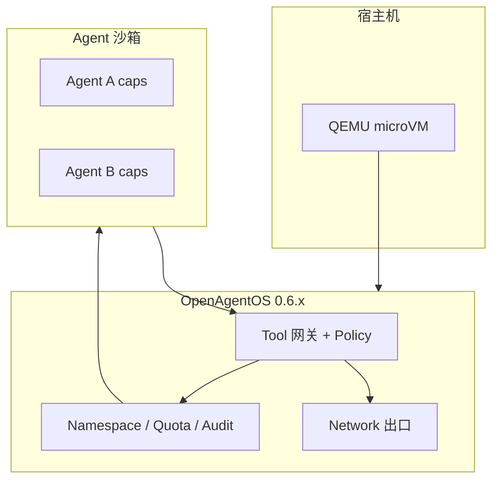

# OpenAgentOS Agent Sandbox 模型

日期：2026-06-04  
相关：[AGENT_MODEL.md](./AGENT_MODEL.md) · [V0.6.x.md](./V0.6.x.md) · [RELEASE_ITERATIONS.md](./RELEASE_ITERATIONS.md)

---

## 1. 定位

OpenAgentOS 不是「再做一个 Linux」，而是 **Agent 沙箱运行时（Agent Sandbox Runtime）**：

- 每个 Agent 在 **能力（cap）+ 命名空间 + 配额 + 策略** 边界内运行  
- 网络、LLM、Fleet 等敏感能力经 **Tool 网关** 统一出口，可审计、可 deny  
- 整机可部署在 **QEMU microVM** 中，相对宿主 OS 再隔离一层  

一句话：**把不可信 Agent 工作负载放进可验收、可策略、可 OTA 的最小 OS 沙箱。**

---

## 2. 三层 Sandbox



| 层 | 名称 | 机制 | 版本 |
|----|------|------|------|
| **L1** | Agent 沙箱 | 独立页表、cap bitmask、IPC 配额 | v6.0–v6.3 ✅ |
| **L2** | 数据沙箱 | `/ns/agent/<id>/home` 私有 mount、audit 分区 | v6.1–v6.2 ✅ |
| **L3** | 网络沙箱 | VirtIO-net 经 policy 限制 egress；`/llm` 仅 router | 0.5.0 ✅ / **0.6.3** 规划 |
| **L0** | 部署沙箱 | QEMU `-netdev user` 整 OS 与宿主隔离 | 0.4.0+ ✅ |

---

## 3. 与现有 v6 能力的关系

| 模块 | Console | Sandbox 作用 |
|------|---------|--------------|
| `tenant` | `/tenant` | Session 配额，防单 Agent 占满内存 |
| `audit` | `/audit` | Tool 调用留痕，跨 Agent 读隔离 |
| `namespace` | `/namespace` | 每 Agent 私有 home，防路径穿越 |
| `quota` | `/quota` | IPC/Tool/FS 三维 burn 上限 |
| `policy` | `/policy` | deny/allow Tool ID |
| `remote` | `/remote` | 默认 disable，token + 单会话 |
| `router` | `/llm` | 无 `CAP_LLM` 不可直连；backend 可选 |

工程 v6 已在 x86 Console 子集验收（`check-console-x86-all`）。**0.6.x 产品线** 把这些能力接到 **带真网络的 RISC-V/x86 产品内核** 上。

---

## 4. 0.6.x 与 Sandbox 路线图

| Patch | 主题 | Sandbox 增量 |
|-------|------|--------------|
| **0.6.0** | x86 net parity | L0 部署沙箱 + 网络栈在 x86 可验收 |
| **0.6.1** | Fleet HTTPS + router | L3 加密 egress（ingest TLS） |
| **0.6.2** | 双平台产品内核 | 同一 semver 下 RV/x86 同等沙箱-net |
| **0.6.3** | Network policy | `/policy net allow` host:port 白名单 |
| **0.6.4** | Sandbox profile | `/sandbox status` 汇总 cap+ns+quota+policy |

详见 [V0.6.x.md](./V0.6.x.md)。

---

## 5. 设计原则

1. **默认 deny**：Remote 默认 off；无 API key 则 `/llm` 失败；Policy 可 deny Tool  
2. **最小 TCB**：Agent 不直接 mmap 网卡；一切经 `netstack` + Tool  
3. **可验收**：每个 sandbox 增量对应 `make check-0.6.x`  
4. **不换 ABI**：Tool 22–25 语义不变，sandbox 在实现层扩展  

---

## 6. 与竞品差异

| 方案 | 隔离 | Agent 语义 | 可 OTA |
|------|------|------------|--------|
| Docker + LangChain | 容器 | 用户态框架 | 宿主 OS |
| WASM microVM | 强 | 无原生 Agent phase | 部分 |
| **OpenAgentOS Sandbox** | cap+ns+quota+microVM | 内核级 Agent | AOS2 OTA |

---

## 7. 参考命令（当前）

```bash
# v6 sandbox 子集（x86，无 net）
make check-console-x86-all

# 0.6.0 sandbox-net（x86，真 TCP/HTTP）
make check-0.6.0

# 0.5.0 sandbox-net + LLM（RISC-V）
make check-0.5.0
```
