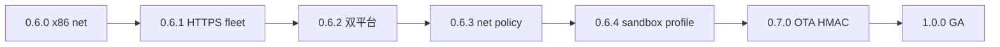

# OpenAgentOS 0.6.x — Agent Sandbox 产品线

日期：2026-06  
主题：**0.6 minor = Agent Sandbox Runtime（网络 + 隔离）**  
索引：[RELEASE_ITERATIONS.md](./RELEASE_ITERATIONS.md) · [SANDBOX.md](./SANDBOX.md) · **GA**：[V1.0.0.md](./V1.0.0.md)

---

## SemVer 策略（0.x 阶段）

| 段 | 含义 | 示例 |
|----|------|------|
| **MINOR** | 产品主题线冻结 | `0.6` = Sandbox + Network |
| **PATCH** | 可交付增量 + `check-*` | `0.6.0` → … → `0.6.4` |
| **下一 MINOR** | 安全线 | `0.7` = OTA HMAC → **1.0.0 GA** |

**原则**：同一 minor 内只增能力、不破坏 ABI；patch 递增即发 Release。

---

## 0.6.x Patch 路线图



| Patch | 状态 | 主题 | 验收 | 设计 |
|-------|------|------|------|------|
| **0.6.0** | ✅ | x86 VirtIO-net PCI parity | `make check-0.6.0` | [V0.6.0.md](./V0.6.0.md) |
| **0.6.1** | ⚠️ | Fleet HTTPS + router faux | `make check-0.6.1` | [V0.6.1_PLAN.md](./V0.6.1_PLAN.md) |
| **0.6.2** | ✅ | RISC-V/x86 双平台产品内核 | `make check-0.6.2` | [V0.6.2_PLAN.md](./V0.6.2_PLAN.md) |
| **0.6.3** | ✅ | Network egress policy 白名单 | `make check-0.6.3` | [V0.6.3_PLAN.md](./V0.6.3_PLAN.md) |
| **0.6.4** | ✅ | `/sandbox status` 统一视图 | `make check-0.6.4` | [V0.6.4_PLAN.md](./V0.6.4_PLAN.md) |

---

## 0.6.0 — x86 sandbox-net parity

**交付**：`kernel-x86-0.6.0.elf` · `scripts/check-0.6.0.sh`

**修复**：`virtio_pci_net.c` 去掉非法 `queue_enable=0`（QEMU PCI 收包恢复）

**Console 序列**：

```
/remote enable → /remote connect → /fleet push →
/fleet ingest http://10.0.2.2:8765/ingest → /quit 0.6.0
```

---

## 0.6.1 — 加密遥测 + 可路由 LLM

- `/fleet ingest https://10.0.2.2:8443/ingest`（`net_https_post_port`）
- `/llm --backend faux` ✅；TLS ingest ⚠️ 待修
- 详见 [V0.6.1_PLAN.md](./V0.6.1_PLAN.md)

---

## 0.6.2 — 双平台同一 semver

- `kernel-console-v062.elf`（RISC-V）+ `kernel-x86-0.6.2.elf`
- `make check-0.6.2` = riscv + x86；x86 `router_svc` 纳入用户链接段

---

## 0.6.3 — 网络沙箱策略

- Policy：`net_allow` / `net restrict`
- Console：`/policy net allow 10.0.2.2:8765`

---

## 0.6.4 — Sandbox 统一入口

- `/sandbox status` — cap / ns / quota / policy / net 摘要
- 纳入 **`check-ga-1.0`**

---

## 0.7.0 — Security（下一 minor）

OTA format-2 HMAC — [V0.7.0.md](./V0.7.0.md)

---

## 回归矩阵

```bash
make check-ga-1.0          # 1.0 GA 聚合
make check-0.5.0           # RISC-V LLM 回归
make check-0.6.0           # x86 net
make check-0.6.2           # 双平台
make check-console-x86-all  # v6 sandbox 回归
```
