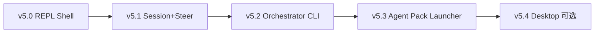

# v5 分阶段实现设计（Console 优先）

日期：2026-06-06  
状态：v5.0 ✅–v5.6 ✅ 已落地；v6.0+ 设计稿  
依赖基线：v4.4 Human I/F（GPU 可选 + UART 回退）✅、v4.2 OTA ✅、v3.3 load ✅、v3.2 Router ✅

相关：[ROADMAP.md](./ROADMAP.md) · [OS_BENCHMARK.md](./OS_BENCHMARK.md)

---

## 1. 目标与原则

### 1.1 目标

把 AgentOS 从「可验收 demo 集合」升级为 **无 GPU 也可用的产品级交互层**：

- **默认路径**：Console / REPL（UART、SSH 串口、QEMU `-nographic`）
- **增强路径**：有 GPU 时再叠 Desktop Shell（窗口、launcher）
- **应用语义不变**：继续走 `agent_svc_*` + 服务 Agent，不引入 Linux/glibc

### 1.2 设计原则

| 原则 | 说明 |
|------|------|
| **Console 优先** | 每个 v5 子版本必须先能在 `check-*-console` 下通过，GPU 为可选加分项 |
| **一阶段一验收** | 每子版本独立 `kernel-*-console.elf` + `make check-console-*` |
| **复用服务 Agent** | router(6) / net(7) / display(8) / input(9) 不重写，只加 `console-agent` |
| **RPC 稳定** | 应用只调 `libagent`；后端 GPU/UART 切换对应用透明（已在 v4.4 验证） |
| **YAGNI** | 不做完整 ncurses、不做多窗口 WM；先 line-REPL，再 steer，再包管理 |

### 1.3 三种 v5 形态（并行产品线）

```
                    ┌─────────────────────────────────┐
                    │  v4 底座：OTA / Router / Net    │
                    └───────────────┬─────────────────┘
                                    │
         ┌──────────────────────────┼──────────────────────────┐
         ▼                          ▼                          ▼
  v5-B Console（主线）      v5-A Desktop（增强）      v5-C Headless Box
  REPL + session + pack      shell-agent + GPU         无本地 UI / Web 管
  无 GPU 必需                依赖 display-agent         延续 edge/box demo
```

**本文件主线**：v5.0 → v5.3 走 Console；v5.4 Desktop 可选；v5-C 另文档。

---

## 2. 总体架构

### 2.1 Agent 拓扑（v5.0 目标态）

```
id=1  init / repl-host          CAP_LOG | SEND | RECV | TIME | FS
id=6  router (已有)             CAP_SVC_LLM | …
id=8  display (已有)            CAP_SVC_DISPLAY | CAP_DISPLAY
id=9  input (已有)              CAP_SVC_INPUT | CAP_INPUT
id=10 console-agent (新增)      CAP_SVC_CONSOLE | CAP_LOG | SEND | RECV

交互链：
  用户 UART  stdin/stdout
       ↕ TOOL_CONSOLE_*（内核行读写，无 GPU）
  console-agent：解析命令、格式化输出
       ↕ MSG_CONSOLE_* / 现有 agent_svc_display
  display-agent → GPU 或 [ui-console]
       ↕ agent_svc_llm / agent_svc_read / agent_spawn
  router / storage / worker agents
```

### 2.2 新增 IPC / Tool（规划）

| 项 | 值 | 说明 |
|----|-----|------|
| `MSG_CONSOLE_REQ` | `0x8028` | client → console：`C{reqid}\|{cmdline}` |
| `MSG_CONSOLE_RSP` | `0x8029` | console → client：`C{reqid}\|{text}` |
| `CONSOLE_AGENT_ID` | `10` | 与 display/input 同级服务 |
| `CAP_SVC_CONSOLE` | `1<<17` | 标识 console 服务 |
| `TOOL_CONSOLE` | `16` | 内核：`GETLINE` / `PUTS` / `PROMPT` |

`TOOL_CONSOLE` 与 v4.4 `TOOL_DISPLAY`/`TOOL_INPUT` 关系：

- **Console 读写**走 `TOOL_CONSOLE`（行缓冲、prompt、退格）
- **大块输出**仍走 `agent_svc_display`（自动 GPU/UART 回退）
- 无 GPU PC 上两者最终都落到 UART，但 Console 负责 **协议与编辑语义**

### 2.3 内核改动范围（尽量小）

| 模块 | v5.0 | v5.1+ |
|------|------|-------|
| `uart.c` | `uart_getline()` 阻塞读行 | 可选简单行编辑（退格） |
| `tool.c` | `run_console` | — |
| `virtio_gpu.c` | 不改 | v5.4 Desktop 再用 |
| 新文件 | `user/console_svc.c`, `user/demo_console.c`, `kernel/kernel_console.c` | 每阶段加 demo |

---

## 3. 分阶段路线图



| 阶段 | 名称 | 验收命令 | 证明点 | 预估规模 |
|------|------|----------|--------|----------|
| **v5.0** | Console REPL | `make check-console` | 无 GPU 下命令行 + `/llm` | ~400 LOC |
| **v5.1** | Session TUI-lite | `make check-console-session` | 多轮对话 + `/compact` | ~300 LOC |
| **v5.2** | Orchestrator CLI | `make check-console-orch` | `/run pipeline` 可视化 | ~350 LOC |
| **v5.3** | Pack Launcher | `make check-console-pack` ✅ | `/list` `/load` worker.agent | ~400 LOC |
| **v5.4** | Desktop Shell | `make check-desktop` | GPU 多面板（可选） | ~800 LOC |
| **v5.5** | Headless Box | `make check-box` | 无 UI 远程管 | ~3s ✅ |

---

## 4. v5.0 — Console REPL Shell

### 4.1 目标

开机进入 **单行 REPL**，无需 VirtIO-GPU；用户输入命令，console-agent 解析并调用已有服务。

### 4.2 内置命令（MVP）

| 命令 | 行为 |
|------|------|
| `/help` | 列出命令 |
| `/echo <text>` | 经 display-agent 输出 |
| `/llm <prompt>` | `agent_svc_llm(..., "faux")` 或 check 脚本用 faux |
| `/agents` | 打印已知服务 id（硬编码表即可） |
| `/quit` | 结束 demo |

### 4.3 文件清单

```
kernel/uart.c              + uart_getline()
kernel/tool.c              + TOOL_CONSOLE
user/console_svc.c         console-agent 主循环
user/demo_console.c        init：发 `/help`、`/llm 17+25`、`/quit`
kernel/kernel_console.c    启动 console + display + input + router
scripts/check-console.sh   无 GPU，fifo stdin 注入命令序列
Makefile                   kernel-console.elf, check-console, run-console
```

### 4.4 验收场景（`check-console.sh`）

1. QEMU **不挂** `virtio-gpu-device`
2. stdin 脚本依次注入：`/help\n` `/llm What is 17+25? Reply with only the number.\n` `/quit\n`
3. 日志必须包含：
   - `[kernel] ui: no GPU`
   - `[console] service ready id=10`
   - `answer: 42` 或 router faux 等价输出
   - `console demo complete`

### 4.5 不做

- 历史命令上下键、Tab 补全
- 彩色 TUI、全屏 ncurses

---

## 5. v5.1 — Session + Steer（pi 语义）

### 5.1 目标

Console 支持 **多轮对话状态**：session 追加/读取、steer 改道、compact 摘要。

### 5.2 新增命令

| 命令 | 行为 |
|------|------|
| `/session tail` | `agent_session_tail` 打印最近 N 条 |
| `/session append <text>` | 写入 session |
| `/compact [keep]` | compact + 打印 `MSG_SUMMARY` |
| `/steer <agent-id> <msg>` | `MSG_STEER` 到目标 Agent |

### 5.3 Demo 流程

```
/session append user:plan edge demo
/llm Summarize in one word.
/session tail
/compact 2
/console demo session complete
```

### 5.4 验收

`make check-console-session`：无 GPU；日志含 session 内容 + compact 摘要 + complete marker。

### 5.5 依赖

v5.0 + v2.0 session API（已有）。

---

## 6. v5.2 — Orchestrator CLI

### 6.1 目标

在 Console 里 **一键触发多 Agent pipeline**（复用 v1.3 orchestrator 语义），输出各阶段状态。

### 6.2 新增命令

| 命令 | 行为 |
|------|------|
| `/run orch` | spawn planner/worker/llm-worker 简化链 |
| `/status` | 打印各 Agent phase（`agent_get_phase` 若暴露，或日志聚合） |

### 6.3 实现策略

- 不重写 orchestrator：init agent 收到 `/run orch` 后发 `MSG_TASK` 给已有 worker 拓扑
- console-agent 只负责 **解析与打印**；编排逻辑放 `user/demo_console_orch.c` 或 `orch_host_agent`

### 6.4 验收

`make check-console-orch`：pipeline 完成 + `sum=42` 或等价 result 出现在 UART 日志。

---

## 7. v5.3 — Agent Pack Launcher ✅

### 7.1 目标

Console 内 **加载/列出** `.agent` 包（v3.3 load + v4.2 OTA 命令面）。

### 7.2 新增命令

| 命令 | 行为 |
|------|------|
| `/list` | init 探测 `worker.agent` 等包是否存在 |
| `/load <path> [name]` | init 经 `MSG_CONSOLE_REQ` 调 `agent_load` |
| `/ota verify <pkg>` | `TOOL_OTA` verify（MVP stub） |
| `/ota apply <pkg>` | apply |
| `/quit pack` | 结束 demo |

### 7.3 架构要点

- **console 无 FS cap**：`/list` `/load` 由 console 发 `MSG_CONSOLE_REQ` → init(id=1) 执行
- **worker 种子**：init 用 `worker_elf.inc` 写入 `/agent/1/worker.agent`
- **调度**：`agent_load` 完成后 `sched_notify_runnable`（避免 console `READ_CHAR` 空转饿死 worker）

### 7.4 产物

```
kernel/kernel_console_pack.c
user/demo_console_pack.c
user/console_svc.c          + /list /load /ota /quit pack
scripts/check-console-pack.sh
scripts/check-console-common.sh   fail-fast ~30s
Makefile                    kernel-console-pack.elf
```

### 7.5 验收

`make check-console-pack`（~4s）：`/list` → `/load` → `[worker] sum=42` → `[pack] load ok` → complete。

### 7.6 依赖

v5.0 + v3.3 elfload + v4.2 ota stub。

---

## 8. v5.4 — Desktop Shell（可选增强）✅

### 8.1 前提

**init** 启动时读 `/sys/gpu`（`ramfs` 由内核 `seed_sys_gpu()` 写入）。无 GPU 时 init 打印 `desktop console fallback` 并退出；**不启动 shell 交互**（请用 `make run-console`）。

### 8.2 组件

| 组件 | 职责 |
|------|------|
| `shell-agent` (id=11) | 全屏文本 launcher，按 `1` 发 `MSG_SHELL_REQ load:worker` |
| `display-agent` (id=8) | 绘制标题与菜单项 |
| `input-agent` (id=9) | virtio-keyboard poll |
| init (id=1) | 处理 load、`agent_load` worker、回 `MSG_SHELL_RSP` |

### 8.3 MVP 范围（已落地）

- 全屏文本 launcher：`[1] worker.agent`
- 按 `1` → init `agent_load` → worker `sum=42`
- **不做**：多窗口、鼠标、图标包目录

### 8.4 验收 ✅

| 命令 | 说明 |
|------|------|
| `make check-desktop` | GPU + virtio-keyboard；QEMU monitor 注入 `sendkey 1`；~5s |
| `make check-desktop-console` | 无 GPU → init fallback |

### 8.5 内核/用户修复（本阶段）

| 项 | 说明 |
|----|------|
| `sched.c` `pick_next` | inbox 有消息的 Agent 优先调度（修复 shell→init IPC 饿死） |
| `sched.c` timer 嵌套 | syscall 期间 timer 不再 `trapframe_store` 内核 sp（修复 user stack 损坏） |
| `agent_svc.c` `svc_recv_match` | 非预期 IPC 消息 defer，避免 RPC 丢消息 |
| `shell_svc.c` | 去掉无 FS 权限的 `/sys/gpu` 读；send 后 `agent_yield` |
| `console_svc.c` `pack_dispatch` | send 后 `agent_yield` 让 init 及时处理 |

---

## 9. v5.5 — Headless Box ✅

### 9.1 目标

无 display/input/GPU 服务，仅 **UART Console REPL** 管理盒内 Agent（`/list` `/load` `/quit box`）。

### 9.2 组件

| 组件 | 职责 |
|------|------|
| `kernel-box.elf` | 仅 console-agent (id=10) + init；ramfs `/sys/headless=1` |
| init | 复用 v5.3 pack 逻辑（`demo_console_pack.c`） |
| `kernel-bench-ipc.elf` | M1 度量：init↔ping(id=2) 32 轮 ping-pong |

### 9.3 热路径优化（M2）

- `TOOL_INPUT` poll 无键（rc=0）跳过 audit
- `TOOL_CONSOLE READ_CHAR` 跳过 audit（减少 console 空转日志）

### 9.4 验收 ✅

| 命令 | 说明 |
|------|------|
| `make check-box` | UART fifo 注入 list/load/quit；无 UI agent 启动 |
| `make bench-ipc` | 32 轮 IPC 往返 + tick 计数 |

---

## 10. v5.6 — Package Catalog ✅

### 10.1 目标

在 v4.2 OTA 签名包与 v5.3 Console `/load` 之上，提供 **包目录**（catalog index）、**版本约束**（min_version）与 **回滚**（`.prev` 备份）。

### 10.2 目录格式

`/agent/1/catalog/index`（init 可写；`/sys/*` 对用户 Agent 只读）：

```
name|version|pkg_path|install_path|channel|min_version
worker|2.0.0|/agent/1/worker-v2.agentpkg|/agent/1/worker.agent|stable|1.0.0
```

### 10.3 Console 命令

| 命令 | 行为 |
|------|------|
| `/catalog list` | `TOOL_CATALOG` LIST |
| `/catalog install <name>` | verify + backup + OTA apply |
| `/catalog rollback <name>` | 从 `.prev` 恢复 |

### 10.4 验收 ✅

`make check-catalog`（~15s）：list → load sum=42 → install v2 → rollback v1。

---

## 9. 与现有模块映射

| 已有能力 | v5 用法 |
|----------|---------|
| v4.4 display/input + UART 回退 | Console/Desktop 输出输入后端 |
| v3.2 router + `agent_svc_llm` | `/llm` 命令 |
| v2.0 session + compact | v5.1 |
| v1.3 orchestrator | v5.2 |
| v3.3 load + v4.2 OTA | v5.3 |
| v4.3 net prod | v5-C Headless 远程管（后续） |

---

## 10. 测试矩阵

| 命令 | GPU | 输入 | 证明 |
|------|-----|------|------|
| `check-console` | 否 | UART fifo | REPL + LLM |
| `check-console-session` | 否 | UART | session/compact |
| `check-console-orch` | 否 | UART | 多 Agent |
| `check-console-pack` | 否 | UART + ramfs | load/OTA |
| `check-ui` | 是 | virtio-kbd | v4.4 回归 |
| `check-ui-console` | 否 | UART | v4.4 回归 |
| `check-desktop` | 是 | kbd | v5.4 ✅ |
| `check-desktop-console` | 否 | — | v5.4 无 GPU fallback ✅ |
| `check-box` | 否 | UART | v5.5 headless ✅ |
| `check-catalog` | 否 | UART + OTA | v5.6 catalog ✅ |

CI 默认跑：**全部 console 系列 + ui-console**（快速层 ~30s）；`check-ui` / `check-desktop` 可在有图形 CI runner 上跑。

**Fail-fast**（2026-06）：`scripts/check-console-common.sh` 统一等待逻辑 — 成功 ~5s/项；失败检测 page fault / console 异常退出，**上限 ~30s**（不再 200s 空等）。详见 [OS_BENCHMARK.md](./OS_BENCHMARK.md) §4。

---

## 11. 推荐实施顺序

```
Done     v5.0–v5.6  Console + Desktop + Headless Box + Catalog + check-* / bench-ipc
Next     v6.0  Multi-tenant
         v4.0  Platform HAL + x86 smoke（并行）
```

---

## 12. 风险与对策

| 风险 | 对策 |
|------|------|
| UART 读行与 QEMU stdin 时序 | fifo + `check-console-common.sh` fail-fast |
| `MSG_PAYLOAD_SIZE=224` 限制命令长度 | REPL 行限制 200 字节 |
| Agent id 冲突 | 固定 `CONSOLE=10`, `SHELL=11`；`MAX_AGENTS=12` |
| shell→init IPC 饿死 | `pick_next` inbox 优先 + send 后 yield ✅ |
| timer 在 syscall 中 corrupt user sp | timer 嵌套路径跳过 `trapframe_store` ✅ |
| console READ_CHAR 空转 + audit | v5.5 热路径跳过 audit ✅ |
| Desktop 分散精力 | v5.4 可选，不阻塞 Console 线 |
| 验收失败空等过长 | `check-console-common.sh` ~30s 上限 ✅ |

---

## 13. 文档同步清单

每完成一子版本更新：

- [x] `docs/ROADMAP.md` — 里程碑矩阵 + Phase v5.x
- [x] `docs/SYSCALL.md` — MSG/TOOL/CAP
- [x] `README.md` — `make check-console*`
- [x] `include/agentos.h` — 常量定义
- [x] `docs/OS_BENCHMARK.md` — 对标与度量
- [x] `docs/V5_IMPLEMENTATION.md` — 每阶段 § 状态（v5.6 ✅）

---

## 14. 下一步

1. **v6.1 Audit 分区** + **v4.0 x86 Console 子集**（并行）
2. **bench 脚本**：按 [OS_BENCHMARK.md](./OS_BENCHMARK.md) 落地 M2–M3
