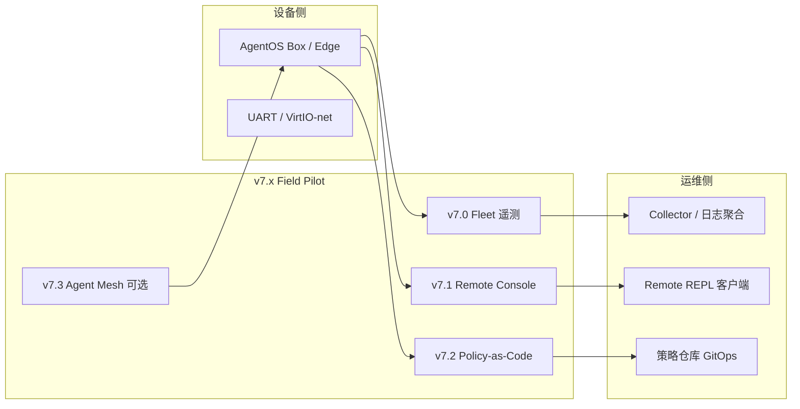
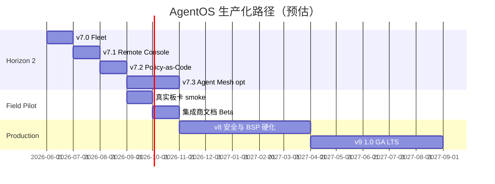

# v7.x Fleet & 生产化路径 — 实现设计

日期：2026-06-08（v0.1-beta 落地：2026-06-04）  
基线：**v0.1-beta**（v6.5 + v7 全栈 x86 GA ✅）  
相关：[ROADMAP.md](./ROADMAP.md) · [V0.1_BETA.md](./V0.1_BETA.md) · [V6_IMPLEMENTATION.md](./V6_IMPLEMENTATION.md) · [OS_BENCHMARK.md](./OS_BENCHMARK.md)

---

## 1. 背景：v6 完成了什么、还缺什么

### 1.1 v6 交付（研究 → 可演示产品）

| 版本 | 能力 | 验收 |
|------|------|------|
| v6.0 | Session 多租户 quota + 跨 Agent 读隔离 | `check-console-tenant` |
| v6.1 | Audit 分区 `/audit/agent/<id>/tool.log` | `check-console-audit` |
| v6.2 | Namespace mount `/ns/agent/<id>/home/` | `check-console-namespace` |
| v6.3 | IPC / Tool / FS 三维配额 | `check-console-quota` |
| v6.4 | x86 Console quota 子集 | `check-console-x86` |
| v6.5 | x86 tenant/audit/namespace 扩展 | `check-console-x86-all` |

**结论**：Agent 语义、Console 产品线、双平台（RISC-V 全量 + x86 Console）已在 **QEMU 参考机** 上可重复验收。

### 1.2 距离「生产可用」仍缺什么

| 维度 | v6.5 现状 | 生产要求 |
|------|-----------|----------|
| 硬件 | QEMU virt / pc | ≥1 款真实板卡或工控机 smoke |
| 运维 | UART 日志 | Fleet 遥测、告警、远程诊断 |
| 接入 | 本地 REPL | Remote Console（SSH/串口代理/Web） |
| 策略 | 代码内 policy | Policy-as-Code、可审计变更 |
| 规模 | 单设备 demo | 多设备编排（Agent Mesh 轻量） |
| 安全 | CAP + audit MVP | 签名启动链、密钥轮换、渗透测试 |
| 发布 | `check-*` CI | stable/beta 渠道 + LTS + 回滚 SLA |
| 文档 | 开发者向 | 集成商手册、API 稳定性承诺 |

v7 聚焦 **Horizon 2：从单设备 demo → 可运维的字段试点（Field Pilot）**；**GA 生产版**放在 v8–v9（见 §6）。

---

## 2. v7 总目标

**一句话**：让 AgentOS 设备 **可被远程看见、远程管、策略可配置**，为多机部署铺路。



**原则**（继承 v6）：

- 不换 Agent syscall ABI / Tool 编号（21 已占用，v7 新增 Tool 从 22 起）
- Console 仍为产品入口；新能力优先暴露为 `/fleet` `/policy` 等 REPL 命令
- 每子版本一个 `make check-*`；x86 与 RISC-V 至少一条路径

---

## 3. 分版本设计

### v7.0 — Fleet 遥测 ✅（v0.1-beta）

**状态**：已合入 `kernel-x86-v01-beta.elf`；验收 `make check-v0.1-beta`。

**目标**：设备周期性上报 **心跳 + 关键指标**，运维侧可聚合。

| 项 | 决策 |
|----|------|
| 数据面 | 复用 `network` 服务 Agent；HTTP POST JSON 到 collector（QEMU: `10.0.2.2` host） |
| 指标 | uptime ticks、Agent 数、phase 分布、quota 用量摘要、最后 OTA 版本、platform 名 |
| 内核 | `kernel/fleet.c` + `TOOL_FLEET` (22)；`fleet_init` / `fleet_tick` / `fleet_export` |
| 持久 | `/agent/0/fleet.json` 缓存最后一次成功上报快照 |
| Console | `/fleet status` `/fleet push` `/fleet probe <url>` |
| Demo | `kernel-console-fleet.elf` + `demo_console_fleet.c` |
| 验收 | `make check-console-fleet`（~5s）；`make check-fleet-x86`（x86 子集，~6s） |

**非目标（v7.0 不做）**：Prometheus 原生 exporter、TLS 双向认证、gRPC。

**工作量估计**：~1–2 周。

---

### v7.1 — Remote Console ✅（v0.1-beta stub）

**状态**：内核 `remote.c` + host `tools/remote-console.py`；验收见 `check-v0.1-beta`。

**目标**：无需物理串口，经网络 **安全接入 Console REPL**（Headless Box 远程管）。

| 项 | 决策 |
|----|------|
| 传输 | VirtIO-net TCP；单会话 line discipline（类似 telnet）；host 侧 `tools/console-proxy.py` |
| 服务 | `remote-console` 服务 Agent (id=12) 或扩展现有 `console` 服务 |
| 认证 | MVP：pre-shared token（ramfs `/sys/console/token`）；v7.1 不做 OAuth |
| 能力 | 远程等价于 UART：`agentos>` prompt、命令透传、audit 留痕 |
| Console | `/remote status` `/remote enable|disable` |
| 验收 | `make check-remote-console`：proxy + QEMU `-netdev user` + FIFO 驱动远程命令 |

**依赖**：v7.0（可选，共享 network 栈）+ v4.3 net prod。

**工作量估计**：~2 周。

---

### v7.2 — Policy-as-Code ✅（v0.1-beta）

**状态**：`policy.c` + `tool_dispatch` consult；验收见 `check-v0.1-beta`。

**目标**：Tool/CAP 策略从 C 硬编码 → **可加载策略包**（JSON 或简化 DSL）。

| 项 | 决策 |
|----|------|
| 格式 | `policy.manifest`：per-agent cap mask、tool allowlist、path prefix rules |
| 存储 | `/sys/policy/active` + `/agent/<id>/policy.override`（可选） |
| 内核 | `kernel/policy.c`；`tool_dispatch` 前 consult policy；`TOOL_POLICY` (23) |
| 变更 | Console `/policy load <path>` `/policy status` `/policy probe <tool>` |
| 审计 | policy 变更写入 audit + fleet 事件 |
| 验收 | `make check-console-policy`：加载 deny GPIO → EPERM；allow READ → ok |

**依赖**：v6.1 audit + v6.3 quota。

**工作量估计**：~2–3 周。

---

### v7.3 — Agent Mesh MVP ✅（v0.1-beta）

**状态**：本地 beacon/probe；跨设备桥接仍为后续迭代。

**目标**：同一局域网内 **Agent 服务发现 + 跨设备 IPC 桥接**（MVP：单跳）。

| 项 | 决策 |
|----|------|
| 发现 | UDP beacon：`AGENTOS\0` + device_id + service table hash |
| 桥接 | `mesh-bridge` 服务 Agent；本地 MSG → 远端 HTTP/JSON RPC |
| 场景 | Box A 的 planner 调用 Box B 的 storage 只读 |
| 验收 | `make check-mesh`：双 QEMU + host relay，cross-box `MSG_FS_READ` |

**风险**：复杂度高；若 v7.0–v7.2 延期，Mesh 可整体后移。

**工作量估计**：~3–4 周。

---

## 4. 构建与平台矩阵（v7）

| 能力 | RISC-V | x86 |
|------|--------|-----|
| Fleet 遥测 | `check-console-fleet` | `check-fleet-x86` |
| Remote Console | `check-remote-console` | 同上（net 栈共享） |
| Policy | `check-console-policy` | 后续 v7.2.1 移植 |
| Mesh | `check-mesh` | 可选 |

x86 策略：v7.0 起每个 Console 子特性 **至少一条 x86 check**（延续 v6.4/v6.5 惯例）。

---

## 5. Tool 编号预留（v7）

| ID | 名称 | 版本 |
|----|------|------|
| 22 | `TOOL_FLEET` | v7.0 |
| 23 | `TOOL_POLICY` | v7.2 |
| 24 | `TOOL_REMOTE` | v7.1（或复用 CONSOLE 子命令） |

详见 [SYSCALL.md](./SYSCALL.md)（v7 落地时更新）。

---

## 6. 生产化里程碑与时间预估

假设 **2026-06-08** 为 v6.5 基线，**1 名全职内核 + 0.5 名 DevOps** 当量（可调）。



### 6.1 阶段定义

| 阶段 | 版本 | 目标日期 | 交付标准 |
|------|------|----------|----------|
| **研究/演示** | v1–v6.5 | **2026-06 ✅** | 全量 `check-*` 绿；双平台 Console |
| **字段试点 Field Pilot** | **v7.x** | **2026-09 ~ 2026-11** | 遥测 + 远程管 + 策略包；1 块真板 smoke |
| **生产候选 RC** | **v8.x** | **2027-Q2** | 签名链、看门狗、渗透测试修复、BSP ≥2 |
| **GA 1.0** | **v9 / 1.0** | **2027-Q3** | stable 渠道 LTS、集成商 SLA、回滚演练 |

### 6.2 「可投入生产」的判定标准（GA 1.0）

以下 **全部满足** 方可对外宣称生产版：

1. **硬件**：≥1 RISC-V SBC + ≥1 x86 工控/无头 PC 通过 smoke（非仅 QEMU）
2. **安全**：OTA 签名 verify 强制、audit 不可篡改路径、已知 CVE 清零
3. **运维**：Fleet 上报 + Remote Console + 告警阈值；7×24 文档化 runbook
4. **发布**：stable/beta 双 channel；LTS 至少 12 个月安全补丁
5. **测试**：CI 分层（快速 ~1min / 标准 ~5min / 扩展 nightly）；发布前全绿
6. **ABI**：syscall / Tool 编号冻结声明；破坏性变更仅 major 版本

### 6.3 保守 vs 积极估计

| 场景 | Field Pilot (v7) | GA 1.0 |
|------|------------------|--------|
| **积极**（2 FTE，无重大阻塞） | 2026-09 | **2027-06** |
| **基准**（1 FTE + 兼职） | 2026-11 | **2027-09** |
| **保守**（真板/BSP 拖延） | 2027-Q1 | **2027-12** |

**推荐对外口径**：**2027 年 Q3** 作为 **AgentOS 1.0 GA** 目标（基准场景）；字段试点客户可 **2026 年 Q4** 起签 POC。

---

## 7. v7 验收速查

```bash
# v0.1-beta GA（x86 全栈）
make check-v0.1-beta

# v6 回归
make check-console-x86-all check-platform
```

---

## 8. 风险与缓解

| 风险 | 影响 | 缓解 |
|------|------|------|
| x86 内核栈/分页仍浅 | 复杂 demo 挂死 | 继续 static 缓冲；大结构放 heap |
| 真板驱动分散精力 | v7 功能延期 | v7 仍 QEMU-first；真板仅 smoke |
| Remote Console 安全 | 字段被扫端口 | token + 单会话 + 默认 disable |
| Policy DSL 膨胀 | 实现失控 | v7.2 仅 JSON manifest + 10 条规则 |
| Mesh 范围蔓延 | 无法交付 | 标为 optional；可整体移至 v8 |

---

## 9. 文档维护

- 每完成 v7.x 子版本：更新 [ROADMAP.md](./ROADMAP.md) 状态列、[SYSCALL.md](./SYSCALL.md) Tool 表、[README.md](../README.md) 版本表
- GA 前：新增 `docs/PRODUCTION.md`（runbook、SLA、硬件清单）

原则：**不换 Agent ABI / Tool 编号**（已分配除外）；Console 为产品入口；每子版本一个 `make check-*`。
