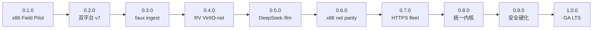

# OpenAgentOS 版本总览

SemVer 产品线文档索引。规范见 [VERSIONING.md](./VERSIONING.md)；路线图见 [PRODUCT_ROADMAP.md](./PRODUCT_ROADMAP.md)。

---

## 版本时间线

---

## 已交付（Release）

| 版本 | 主题 | 平台 | 内核 | 验收 | 文档 |
|------|------|------|------|------|------|
| **0.1.0** | v6+v7 Field Pilot 子 OS | x86 | `kernel-x86-v01-beta.elf` | `check-0.1.0` | [V0.1.0.md](./V0.1.0.md) |
| **0.2.0** | 双平台 v7 + Policy load | x86 + RV | `kernel-x86-v02-rc.elf` | `check-0.2.0` | [V0.2.0.md](./V0.2.0.md) |
| **0.3.0** | Fleet ingest + Remote ping（faux） | x86 | `kernel-x86-0.3.0.elf` | `check-0.3.0` | [V0.3.0.md](./V0.3.0.md) |
| **0.4.0** | VirtIO-net 真 HTTP/TCP | **RISC-V** | `kernel-console-v040.elf` | `check-0.4.0` | [V0.4.0.md](./V0.4.0.md) |
| **0.5.0** | Console `/llm` DeepSeek 直连 | **RISC-V** | `kernel-console-v050.elf` | `check-0.5.0` | [V0.5.0.md](./V0.5.0.md) |

别名：`check-v0.1-beta` = `check-0.1.0`；`check-v0.2-rc` = `check-0.2.0`；`check-remote-console` = `check-0.4.0`；`check-llm-console` = `check-0.5.0`。

---

## 规划中（Design）

| 版本 | 主题 | 退出标准 | 文档 |
|------|------|----------|------|
| **0.6.0** | x86 VirtIO-net PCI parity | `check-x86-0.4.0` | [V0.6.0_PLAN.md](./V0.6.0_PLAN.md) |
| **0.7.0** | Fleet HTTPS + router 多 backend | `check-0.7.0` | [V0.7.0_PLAN.md](./V0.7.0_PLAN.md) |
| **0.8.0** | 双平台统一 Console 产品内核 | `check-0.8.0` | [V0.8.0_PLAN.md](./V0.8.0_PLAN.md) |
| **0.9.0** | OTA 签名强制 + 安全审计 | `check-0.9.0` | [V0.9.0_PLAN.md](./V0.9.0_PLAN.md) |
| **1.0.0** | GA LTS、真板、集成商文档 | GA 清单全绿 | [V1.0.0_GA.md](./V1.0.0_GA.md) |

---

## 单页文档结构（模板）

每个 **已交付** minor 版本文档包含：

1. **元信息** — SemVer、日期、状态、前序/后续版本  
2. **定位** — 相对上一版的增量与对比表  
3. **新增 / 变更 / 继承**  
4. **快速开始** — 构建、运行、验收命令与耗时  
5. **Console 演示** — 推荐命令序列  
6. **内核与模块** — 产物、源码路径  
7. **Host 工具** — collector / gateway 等  
8. **验收** — log 关键字、失败排查  
9. **已知限制与非目标**  
10. **回归** — 建议一并跑的 check  

每个 **规划** 版本文档包含：动机、交付物、退出标准、实现要点、风险、Release checklist。

---

## 能力演进（一表速览）

| 能力 | 0.1 | 0.2 | 0.3 | 0.4 | 0.5 | 0.6 | 1.0 |
|------|-----|-----|-----|-----|-----|-----|-----|
| x86 Console v6/v7 | ✅ | ✅ | ✅ | exp | exp | net | ✅ |
| RISC-V v7 真栈 | stub | ✅ | ✅ | ✅ | ✅ | ✅ | ✅ |
| Policy 文件 load | 内存 | ✅ | ✅ | ✅ | ✅ | ✅ | ✅ |
| Fleet → collector | stub | probe | faux ingest | net HTTP | net HTTP | net HTTP | TLS |
| Remote | stub | stub | faux ping | TCP | TCP | TCP | token+审计 |
| `/llm` DeepSeek | faux | faux | faux | faux | HTTPS | HTTPS | HTTPS |
| 产品验收平台 | x86 | x86+RV | x86 | RV | RV | x86+RV | 真板 |

---

## 工程线 vs 产品线

| 工程里程碑 | 映射产品版本 |
|------------|--------------|
| v6.0–v6.5 Multi-tenant Console | 合入 0.1.0 |
| v7.0 Fleet · v7.1 Remote · v7.2 Policy · v7.3 Mesh | 0.1.0 x86；0.2.0 起 RISC-V 真栈 |
| v4.3 Net · v4.3.1 LLM net | 0.4.0 / 0.5.0 RISC-V |
| v8 安全 / BSP | 0.9.0 → 1.0.0 |

---

## 维护约定

- 每交付一个 minor：新增/更新 `V0.X.0.md`，更新本页与 [PRODUCT_ROADMAP.md](./PRODUCT_ROADMAP.md)  
- 每开始一个 minor 设计：新增 `V0.X.0_PLAN.md` 或 `V1.0.0_GA.md`  
- `include/version.h` 的 `OPENAGENTOS_VERSION` 与当前 **已交付** 最高 minor 对齐  
- 旧文件名 [V0.1_BETA.md](./V0.1_BETA.md)、[V0.2_RC.md](./V0.2_RC.md) 保留为重定向 stub
